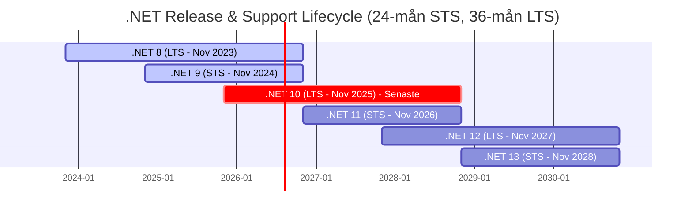

---
layout: post
title: "Är det dags att lämna .NET Framework för .NET 10?"
date: 2026-06-01 07:15 +0200
category: "c-sharp,.NET,programmering"
---

Sitter er organisation fortfarande med system byggda på det klassiska .NET Framework (t.ex. version 4.8)? Ni är inte ensamma. Det har varit en otroligt stabil plattform som har tjänat företag väl i över ett decennium. Men tekniklandskapet har förändrats...

<!--more-->

Att stanna kvar på det gamla .NET Framework innebär idag en växande affärsrisk. Den moderna plattformen – där **.NET 10** just nu är guldstandarden – erbjuder inte bara snabbare applikationer, utan också lägre driftkostnader och betydligt säkrare system.

I den här artikeln tänkte jag gå igenom varför jag anser att ni måste planera er uppgradering, och hur ni bäst navigerar Microsofts release-strategi för att minimera risker och maximera innovation i ett enterprise-företag.

---

## 1. Varför lämna det trygga .NET Framework?

Att uppgradera handlar i min värld inte om att jaga de senaste tekniska trenderna – det handlar om ren affärsnytta och riskminimering. Microsoft lade .NET Framework i "underhållsläge" redan 2019. Inga nya funktioner byggs, och plattformen saknar helt stöd för moderna, kostnadseffektiva molnarkitekturer.

Här är de tre starkaste anledningarna jag ser till att ta steget till .NET 10:

* **Drastiskt lägre molnkostnader (ROI):** Det moderna .NET är ombyggt från grunden för extrem prestanda. Applikationerna drar mycket mindre minne och processorkraft. För företag som kör systemen i molnet (som Azure eller AWS) innebär detta att man kan skala ner sina servrar och direkt spara stora pengar varje månad.
* **Säkerhet i framkant:** Hotbilden på nätet förändras dagligen. .NET 10 har inbyggt stöd for de absolut senaste säkerhetsprotokollen och krypteringarna, något det äldre ramverket helt enkelt inte uppdateras med längre.
* **Kompetensförsörjning:** Utvecklare vill jobba med moderna verktyg. Att sitta fast i gammal "legacy-kod" gör det svårt att attrahera och behålla topptalanger. Med .NET 10 får teamen tillgång till AI-verktyg och moderna funktioner som gör dem betydligt mer produktiva.

---

## 2. Förstå Microsofts releasecykel: LTS vs. STS

När man går över till den moderna .NET-plattformen är det kritiskt att förstå hur Microsoft släpper sina uppdateringar. Varje november lanserar Microsoft en ny huvudversion, och dessa är uppdelade i två kategorier: **LTS** och **STS**.

| Egenskap | LTS (Long Term Support) | STS (Standard Term Support) |
| :--- | :--- | :--- |
| **Versionsnummer** | Jämna nummer (.NET 8, **10**, 12) | Udda nummer (.NET 9, 11) |
| **Supporttid** | **3 år** (36 månader) | **2 år** (24 månader)   *Gäller från .NET 9* |
| **Huvudfokus** | Maximal stabilitet och trygghet för produktion. | Nya funktioner och tidig tillgång till innovation. |
| **Microsofts syn** | Båda har samma höga kvalitet, men LTS ger arbetsro och förutsägbarhet över tid. | En brygga till nästa version. Perfekt för dem som snabbt vill nyttja den senaste tekniken. |

<!--  -->

---

## 3. Enterprise-strategi: LTS i produktion, STS i test

Hur bör då ett större företag (Enterprise) hantera denna cykel på bästa sätt? Jag förespråkar en hybridstrategi som effektivt balanserar driftsäkerhet med proaktiv framförhållning.

### Kör alltid LTS i produktionsmiljö

I de skarpa miljöerna – där kunderna och verksamheten befinner sig, och pengarna rullar – är mitt råd att **alltid välja LTS-spåret (jämna versioner, som .NET 10 - senare 12)**.

* **Varför?** Det ger er tre års garanterad support och säkerhetsuppdateringar. Ni slipper stressen av att behöva göra stora plattformsuppdateringar varje år. Det ger IT-avdelningen lugn och ro, samtidigt som verksamheten får system som är stabila som bergsklippor.

### Använd STS aktivt i utvecklings- och testmiljöer

Även om jag avråder från att köra STS (udda versioner, som .NET 9 eller framtida .NET 11) i skarp produktion, är det ett strategiskt misstag att helt ignorera dem. **Min starka rekommendation är att låta utvecklingsteamen installera och utvärderar STS-versionerna lokalt och i isolerade testmiljöer.**

* **Varför?** Genom att tidigt provköra er befintliga kod mot nästa version kan teamet upptäcka så kallade *breaking changes* (förändringar i ramverket som gör att gammal kod slutar fungera) långt innan det blir kritiskt. Det gör att ni kan fånga och åtgärda potentiella buggar tidigt i processen.
* **Affärsvärdet:** När det väl blir dags för företaget att göra den stora uppgraderingen till nästa LTS-version (t.ex. från .NET 10 till .NET 12), blir projektet en snabb och helt odramatisk icke-händelse. Eftersom teamet kontinuerligt har säkrat koden mot de udda versionerna i testmiljön. Det gör att ni slipper massiva, tidskrävande och riskfyllda "Big Bang"-uppgraderingar.

---

## Sammanfattning

Att lämna det gamla .NET Framework är inte längre en fråga om *om*, utan om *när*. Genom att sikta på **.NET 10 (LTS)** säkrar ni prestanda, sänker era driftkostnader och får en modern säkerhetsarkitektur.

Genom att sedan applicera min strategi – där LTS rullar tryggt i produktion medan utvecklarna tillåts experimentera och kvalitetssäkra mot STS-versionerna på hemmaplan – skapar ni en IT-organisation som både är extremt stabil idag och helt förberedd för morgondagen.

---

### Källor och vidare läsning

* [Microsoft .NET Support Policy](https://dotnet.microsoft.com/en-us/platform/support/policy)
* [Microsoft .NET Core & Modern .NET Release Cadence](https://dotnet.microsoft.com/en-us/platform/support/policy/dotnet-core#cadence)
* [Microsoft .NET Framework Support Policy](https://dotnet.microsoft.com/en-us/platform/support/policy/dotnet-framework)
* [Historien bakom .NET - pownas.se](https://blog.pownas.se/2026/05/24/historien-bakom-dotnet/)
