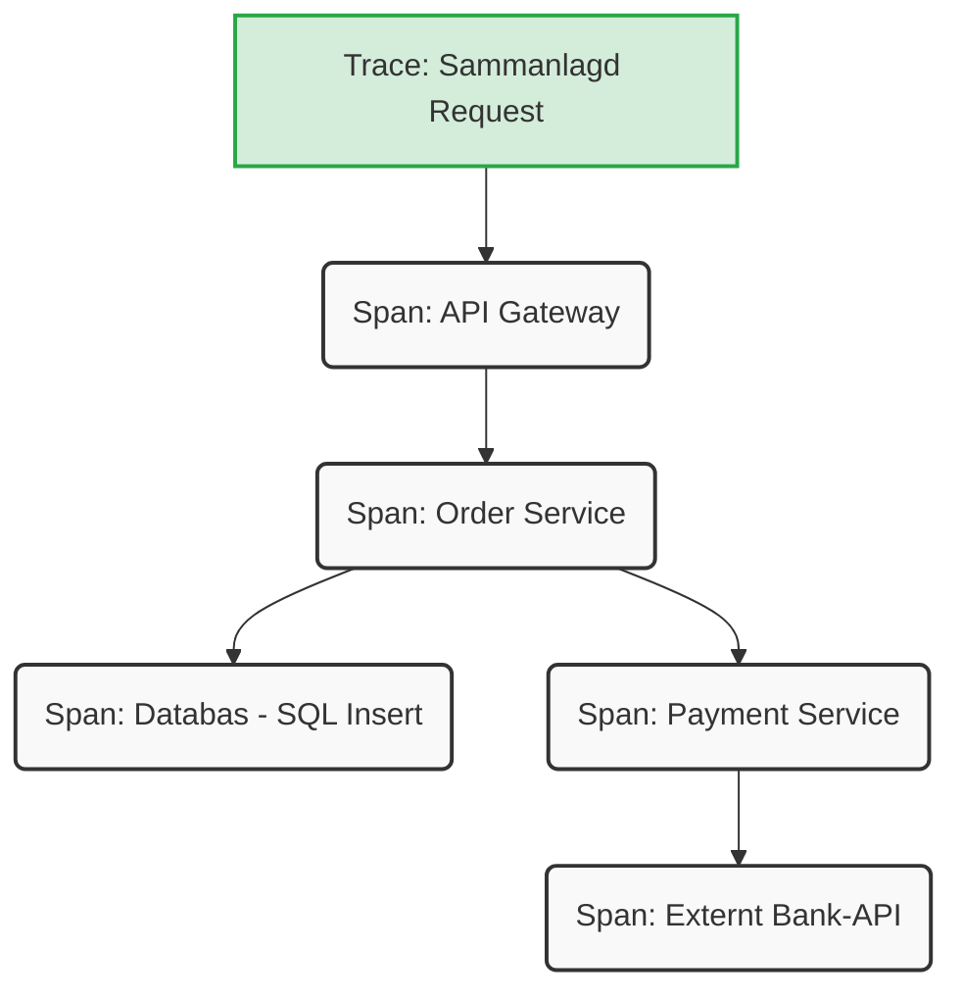

I moderna, distribuerade system räcker det sällan med traditionell felloggning. När ett anrop från en användare studsar genom en API-gateway, två mikrotjänster och en databas, och något går fel – hur vet du var flaskhalsen eller kraschen uppstod?

Svaret är **Observability** (observerbarhet), och branschstandarden för detta är **OpenTelemetry (OTel)**. I den här guiden ska vi bryta ner de centrala koncepten *Traces* och *Spans*, och titta på hur vi implementerar dem i .NET 10.

<!--more-->

## Vad är Traces och Spans?
Innan vi dyker ner i kod behöver vi förstå vokabulären. OpenTelemetry bygger på tre pelare: Traces, Metrics och Logs. När vi vill följa ett request genom ett system är det Traces vi tittar på.
 * **Trace (Spår):** En trace representerar hela resan för ett specifikt anrop eller en operation genom ditt system. Tänk på det som ett kvitto på allt som hände från att användaren klickade på en knapp tills svaret returnerades.
 * **Span (Spann):** En trace består av en eller flera spans. En span representerar en enskild logisk operation inom det spåret. Det kan vara en databasfråga, ett HTTP-anrop till en annan tjänst, eller en tung beräkning i koden.

Varje span innehåller viktig metadata, såsom starttid, sluttid, status (ok/error) och anpassade attribut (tags) som hjälper till att ge kontext (t.ex. user.id eller order.id).

### Hur hänger de ihop?

När ett anrop kommer in startas en "Root Span". När den koden i sin tur anropar andra metoder eller tjänster skapas "Child Spans". Tillsammans bildar de ett hierarkiskt träd, vilket vi kan visualisera så här:

```mermaid
gantt
    title Exempel på en Trace genom ett distribuerat system
    dateFormat X
    axisFormat %s

    section API Gateway
    Root Span (Ta emot request) :a1, 0, 100

    section Order Service
    Validera Order (Child Span 1) :a2, 10, 30
    Spara till DB (Child Span 2)  :a3, 30, 80

    section Payment Service
    Dra pengar (Child Span 3)     :a4, 40, 75

```



Ett annat sätt att se på det är via tjänstehierarkin:


## .NET 10 och OpenTelemetry
En av de absolut starkaste fördelarna med .NET är hur djupt integrerat OpenTelemetry är i plattformen. Istället för att använda ett specifikt OTel-SDK för att skapa spans, använder .NET sina inbyggda klasser i System.Diagnostics.

I .NET-världen är terminologin något annorlunda, men koncepten är identiska:
 * En **Tracer** (OTel) motsvaras av en ActivitySource i .NET.
 * En **Span** (OTel) motsvaras av en Activity i .NET.

### 1. Uppsättning och Konfiguration
För att komma igång i ett nytt .NET 10-projekt behöver du lägga till några NuGet-paket. Central Package Management (CPM) är starkt rekommenderat för större lösningar, men paketen du behöver är:
 * OpenTelemetry.Extensions.Hosting
 * OpenTelemetry.Instrumentation.AspNetCore
 * OpenTelemetry.Instrumentation.Http
 * OpenTelemetry.Exporter.Console *(eller OTLP för export till system som Jaeger, Aspire Dashboard eller Datadog)*

I din Program.cs sätter du upp OpenTelemetry:

```csharp
using OpenTelemetry.Resources;
using OpenTelemetry.Trace;

var builder = WebApplication.CreateBuilder(args);

// 1. Definiera tjänstens namn och version
var resourceBuilder = ResourceBuilder.CreateDefault()
    .AddService(serviceName: "MyOrderService", serviceVersion: "1.0.0");

// 2. Konfigurera OpenTelemetry
builder.Services.AddOpenTelemetry()
    .WithTracing(tracerProviderBuilder =>
    {
        tracerProviderBuilder
            .SetResourceBuilder(resourceBuilder)
            // Instrumentera inkommande HTTP-anrop automatiskt
            .AddAspNetCoreInstrumentation()
            // Instrumentera utgående HTTP-anrop automatiskt
            .AddHttpClientInstrumentation()
            // Lyssna på våra egna anpassade spans
            .AddSource(Telemetry.SourceName)
            // Exportera till konsolen för demonstration
            .AddConsoleExporter(); 
    });

var app = builder.Build();

app.MapGet("/order", () => 
{
    // Detta anrop kommer automatiskt att få en root span av ASP.NET Core
    return Results.Ok("Order hanterad");
});

app.Run();

```
### 2. Skapa anpassade Spans i koden
Automatisk instrumentering är fantastiskt, men ofta vill man lägga till specifik affärslogik i sina traces. För detta skapar vi en central ActivitySource och initierar egna Activity-objekt (spans).
```csharp
using System.Diagnostics;

// Skapa en central klass för vår telemetri
public static class Telemetry
{
    public const string SourceName = "MyOrderService.Domain";
    // ActivitySource är den instans som skapar våra spans
    public static readonly ActivitySource ActivitySource = new(SourceName);
}

public class OrderProcessor
{
    public void ProcessOrder(int orderId, string customerName)
    {
        // Starta en ny span. Den blir automatiskt en child span 
        // om den anropas inifrån kontexten av t.ex. ett API-anrop.
        using var activity = Telemetry.ActivitySource.StartActivity("ProcessOrder");

        // Lägg till metadata som gör spåret sökbart i ditt övervakningssystem
        activity?.SetTag("order.id", orderId);
        activity?.SetTag("customer.name", customerName);

        try
        {
            // Lägg till en specifik händelse (logg) i tidslinjen
            activity?.AddEvent(new ActivityEvent("Påbörjar validering av order"));
            
            // Simulera lite affärslogik...
            Thread.Sleep(50); 
            
            activity?.AddEvent(new ActivityEvent("Order validerad och klar"));

            // Markera spåret som lyckat
            activity?.SetStatus(ActivityStatusCode.Ok);
        }
        catch (Exception ex)
        {
            // Om något går fel, registrera felet i spåret
            activity?.SetStatus(ActivityStatusCode.Error, "Processeringen misslyckades.");
            activity?.RecordException(ex);
            throw;
        }
    }
}

```

## Sammanfattning
Att införa OpenTelemetry i dina .NET 10-applikationer är inte bara en "nice-to-have" – det är ett fundamentalt arkitekturbeslut för att kunna drifta och underhålla komplexa system. Genom att förstå hur *Traces* ger dig helhetsbilden och hur *Spans* ger dig detaljerna, kombinerat med .NET:s inbyggda Activity-API, kan du bygga in observerbarhet direkt från start.


## OpenTelemetry – Koncept och Standarder
Dessa källor bekräftar branschstandarden och hur begreppen är definierade oberoende av programmeringsspråk.
 * [**Traces och Spans (OpenTelemetry Docs)**](https://opentelemetry.io/docs/concepts/signals/traces/)
   Beskriver grundkoncepten för distribuerad spårning. Källan definierar formellt vad en *Trace* och en *Span* är, hur de bildar en hierarki med parent/child-relationer, samt hur attribut och events fungerar.
 * [**Observability Primer (OpenTelemetry Docs)**](https://opentelemetry.io/docs/concepts/observability-primer/)
   Ger den övergripande teorin bakom "Observerbarhet" (Observability) och varför traditionell felloggning inte räcker till i distribuerade system och mikrotjänster.
 * [**Context Propagation (OpenTelemetry Docs)**](https://opentelemetry.io/docs/concepts/context-propagation/)
   Förklarar mekaniken bakom hur en "Trace Context" (som Trace ID och Span ID) skickas mellan olika tjänster (ofta via HTTP-headers) för att binda ihop de olika delarna av ett anrop till en sammanhängande Trace.

## Microsoft Learn – Implementation i .NET
Microsofts dokumentation bekräftar hur .NET-teamet har valt att integrera OpenTelemetry genom inbyggda klasser i System.Diagnostics.
 * [**.NET Observability with OpenTelemetry (Microsoft Learn)**](https://learn.microsoft.com/en-us/dotnet/core/diagnostics/observability-with-otel)
   Microsofts huvudguide för observerbarhet. Den bekräftar den centrala arkitekturen: .NET använder System.Diagnostics för att generera telemetrin, och OpenTelemetry agerar "Collector" för att exportera datan.
 * [**Add distributed tracing instrumentation (Microsoft Learn)**](https://learn.microsoft.com/en-us/dotnet/core/diagnostics/distributed-tracing-instrumentation-walkthroughs)
   Källan till kodexemplen för hur man skapar egna (custom) Spans. Guiden går igenom "Best practices" för att skapa en statisk ActivitySource och hur man använder using-block med StartActivity().
 * [**Distributed tracing in System.Net libraries (Microsoft Learn)**](https://learn.microsoft.com/en-us/dotnet/fundamentals/networking/telemetry/tracing)
   Bekräftar hur ramverket (som ASP.NET Core och HttpClient) redan är instrumenterat från start, vilket gör att automatisk instrumentering kan fånga inkommande och utgående HTTP-trafik.

### Terminologi: .NET vs OpenTelemetry
Eftersom .NET:s API för spårning existerade innan OpenTelemetry blev en färdig standard, använder Microsoft delvis andra namn på klasserna. Denna tabell (baserad på guiden "Add distributed tracing instrumentation" ovan) mappar dem mot varandra:
| OpenTelemetry-begrepp | .NET-klass (System.Diagnostics) | Förklaring |
|---|---|---|
| **Tracer** | ActivitySource | Fabriken/instansen som skapar och hanterar dina spans. |
| **Span** | Activity | Representerar en specifik operation och dess livscykel. |
| **Span Attribute** | Activity.SetTag() | Nyckel/värde-par för att skicka med metadata (t.ex. order-ID). |
| **Span Event** | Activity.AddEvent() | En tidsstämplad logghändelse inuti en specifik span. |
