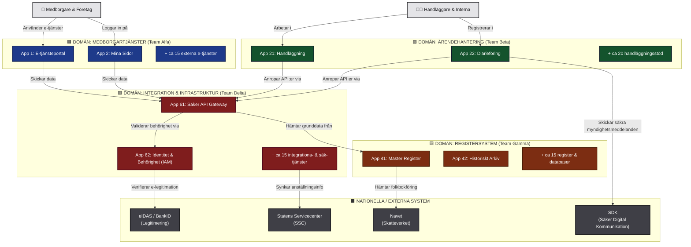
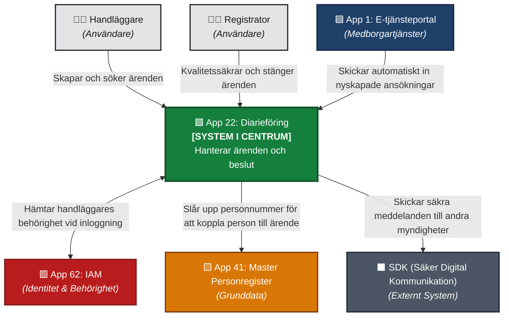
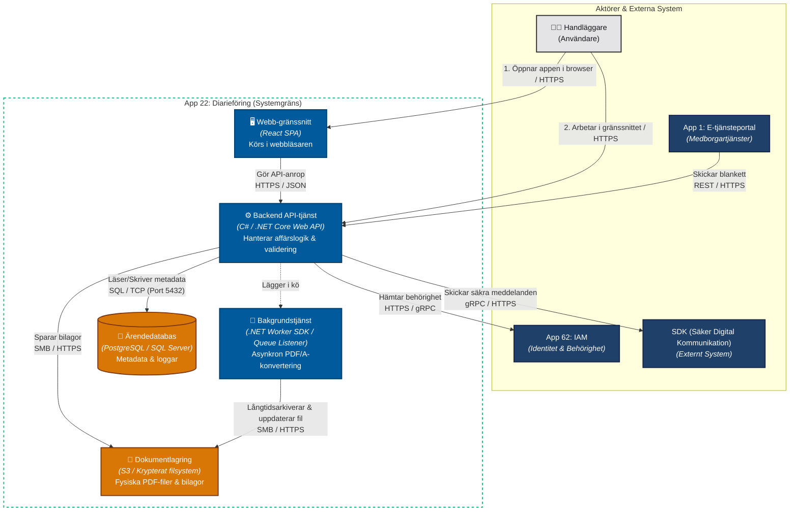
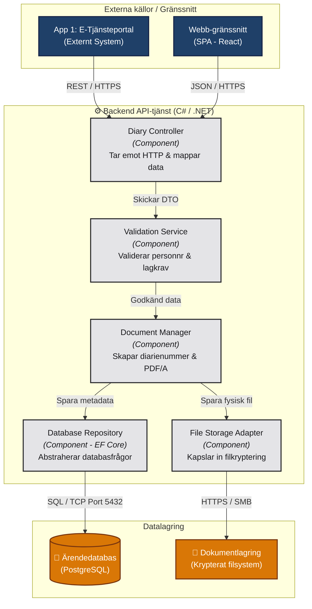

Att hålla reda på en växande applikationsportfölj är en av de största utmaningarna i moderna utvecklingsorganisationer. När systemen passerar 20+, eller till och med närmar sig 100+ olika applikationsdelar, blir det snabbt omöjligt att bibehålla en gemensam syn om ingen har en tydlig helhetsbild.

Att dokumentera allt i tunga textdokument tröttar ut vem som helst och leder till passivitet. För att bryta silon mellan era utvecklingsteam krävs en visuell, interaktiv och levande metod där arkitekturen ritas upp gemensamt.

<!--more-->

## Hemligheten bakom en lyckad kartläggning: Gör det till en workshop

Låt inte en enskild arkitekt sitta på sin kammare och rita en perfekt, men steril karta. Sätt istället ihop personer från era olika utvecklingsteam i tvärfunktionella grupper.

* **Samlas kring en digital rityta:** Använd flexibla, visuella verktyg som Miro, FigJam eller Mural där alla kan bidra samtidigt.
* **Mappa beroenden tillsammans:** När utvecklarna gemensamt diskuterar hur systemen faktiskt integrerar med varandra, uppstår de där ovärderliga "Aha!"-ögonblicken som bygger en sann gemensam vision.


## C4-modellen: Arkitekturens svar på Google Maps

För att en portfölj med tiotals applikationer inte ska explodera i en oläslig "spagettikarta" behöver vi en struktur för hur vi zoomar in och ut. Det är här **C4-modellen** briljerar. Den fungerar precis som en digital världskarta: du börjar med en global översiktsbild (hela landet) och zoomar stegvis in ändå till kvarteret och enskilda hus.

Här är den konkreta guiden för hur ni steg för steg tar er an systemlandskapet:

### Nivå 0: System Landscape Diagram (Hela landet)

Innan ni kastar er in i de officiella C4-nivåerna, måste ni börja med en övergripande systemkartläggning. Har ni ett stort landskap på upp emot 25+ applikationer är detta er absolut viktigaste startpunkt.

* **Vad det visar:** Alla era applikationer visualiseras som höglevellådor, tillsammans med era primära användargrupper och kritiska externa system (såsom BankID, externa API:er eller betalväxlar).
* **Regel:** Håll det på en strikt makronivå! Gå inte in på databaser, mikrotjänster eller kodspråk här. En låda representerar en logisk applikation (t.ex. "Kundportal" eller "Faktureringsmotor").
* **Hur ni gör det:** Skriv upp applikationerna på digitala lappar, gruppera dem grovt efter domän eller affärsområde (t.ex. Ekonomi, Logistik, Kundresa) och rita enbart ut de absolut viktigaste integrationslinjerna. Fokusera på de kritiska flödenna.


Nivå 0: System Landscape Diagram - Myndighetsperspektiv


Nivå 0: System Landscape Diagram - Onlineshop-perspektiv



<details>
<summary>Mermaid koden för Nivå 0: System Landscape Diagram</summary>

```
graph TD
    %% Styling - WCAG AA-säkrade klasser (Tydlig kontrast och färgstyrning för alla teman)
    classDef blueTeam fill:#1e3a8a,stroke:#172554,stroke-width:2px,color:#ffffff;
    classDef greenTeam fill:#14532d,stroke:#0f172a,stroke-width:2px,color:#ffffff;
    classDef yellowTeam fill:#7c2d12,stroke:#451a03,stroke-width:2px,color:#ffffff;
    classDef redTeam fill:#7f1d1d,stroke:#4c0519,stroke-width:2px,color:#ffffff;
    classDef externalSystem fill:#3f3f46,stroke:#18181b,stroke-width:2px,color:#ffffff;
    classDef actor fill:#e4e4e7,stroke:#27272a,stroke-width:2px,color:#18181b;

    %% Aktörer (Överst)
    Medborgare["👥 Medborgare & Företag"]:::actor
    Handlaggare["🧑‍💼 Handläggare & Interna"]:::actor

    %% DOMÄN: Medborgartjänster (Team Alfa)
    subgraph AlfaDomain ["🟦 DOMÄN: MEDBORGARTJÄNSTER (Team Alfa)"]
        App1["App 1: E-tjänsteportal"]:::blueTeam
        App2["App 2: Mina Sidor"]:::blueTeam
        AppMiscAlfa["+ ca 15 externa e-tjänster"]:::blueTeam
    end

    %% DOMÄN: Ärendehantering (Team Beta)
    subgraph BetaDomain ["🟩 DOMÄN: ÄRENDEHANTERING (Team Beta)"]
        App21["App 21: Handläggning"]:::greenTeam
        App22["App 22: Diarieföring"]:::greenTeam
        AppMiscBeta["+ ca 20 handläggningsstöd"]:::greenTeam
    end

    %% DOMÄN: Registersystem (Team Gamma)
    subgraph GammaDomain ["🟨 DOMÄN: REGISTERSYSTEM (Team Gamma)"]
        App41["App 41: Master Register"]:::yellowTeam
        App42["App 42: Historiskt Arkiv"]:::yellowTeam
        AppMiscGamma["+ ca 15 register & databaser"]:::yellowTeam
    end

    %% DOMÄN: Gemensam Infrastruktur & Integration (Team Delta)
    subgraph DeltaDomain ["🟥 DOMÄN: INTEGRATION & INFRASTRUKTUR (Team Delta)"]
        App61["App 61: Säker API Gateway"]:::redTeam
        App62["App 62: Identitet & Behörighet (IAM)"]:::redTeam
        AppMiscDelta["+ ca 15 integrations- & säk-tjänster"]:::redTeam
    end

    %% Nationella / Externa System (Nederst)
    subgraph NationalSystems ["⬛ NATIONELLA / EXTERNA SYSTEM"]
        eIDAS["eIDAS / BankID<br/>(Legitimering)"]:::externalSystem
        SSC["Statens Servicecenter<br/>(SSC)"]:::externalSystem
        Navet["Navet<br/>(Skatteverket)"]:::externalSystem
        SDK["SDK<br/>(Säker Digital Kommunikation)"]:::externalSystem
    end

    %% Flöden och Relationer

    %% Aktörernas ingångar
    Medborgare -->|"Använder e-tjänster"| App1
    Medborgare -->|"Loggar in på"| App2
    Handlaggare -->|"Arbetar i"| App21
    Handlaggare -->|"Registrerar i"| App22

    %% Flöden mellan domäner (via integrationer)
    App1 & App2 -->|"Skickar data"| App61
    App21 & App22 -->|"Anropar API:er via"| App61

    App61 -->|"Hämtar grunddata från"| App41
    App61 -->|"Validerar behörighet via"| App62

    %% Integrationer ut mot nationella system
    App62 -->|"Verifierar e-legitimation"| eIDAS
    AppMiscDelta -->|"Synkar anställningsinfo"| SSC
    App41 -->|"Hämtar folkbokföring"| Navet
    App22 -->|"Skickar säkra myndighetsmeddelanden"| SDK

```

</details>
<br />

### Nivå 1: System Context Diagram (Staden)

När helhetskartan är på plats zoomar ni in på ett system i taget. System Context-diagrammet sätter en specifik applikation i absolut centrum.

* **Vad det visar:** Applikationen i mitten, vilka specifika användare som interagerar med den, samt vilka andra interna eller externa system den pratar direkt med.
* **Målgrupp:** Detta diagram är ett fantastiskt verktyg för produktägare, nya utvecklare och externa intressenter eftersom det snabbt förklarar *varför* systemet finns och *vem* det hjälper.


Nivå 1: System Context Diagram



<details>
<summary>Mermaid koden för Nivå 1: System Context Diagram</summary>

```
graph TD
    %% Styling - WCAG AA-säkrade klasser (Tydlig kontrast i både Light & Dark Mode)
    classDef mainSystem fill:#15803d,stroke:#14532d,stroke-width:3px,color:#ffffff;
    classDef blueSystem fill:#1f4068,stroke:#162447,stroke-width:2px,color:#ffffff;
    classDef redSystem fill:#b91c1c,stroke:#7f1d1d,stroke-width:2px,color:#ffffff;
    classDef yellowSystem fill:#d97706,stroke:#78350f,stroke-width:2px,color:#ffffff;
    classDef externalSystem fill:#4b5563,stroke:#1f2937,stroke-width:2px,color:#ffffff;
    classDef actor fill:#e4e4e7,stroke:#27272a,stroke-width:2px,color:#18181b;

    %% Användare (Aktörer)
    Handlaggare["🧑‍💼 Handläggare<br/><i>(Användare)</i>"]:::actor
    Registrator["🧑‍💻 Registrator<br/><i>(Användare)</i>"]:::actor

    %% Systemet i fokus (Mitten)
    App22["🟩 App 22: Diarieföring<br/><b>[SYSTEM I CENTRUM]</b><br/>Hanterar ärenden och beslut"]:::mainSystem

    %% Integrerade system (Grannar)
    App1["🟦 App 1: E-tjänsteportal<br/><i>(Medborgartjänster)</i>"]:::blueSystem
    App62["🟥 App 62: IAM<br/><i>(Identitet & Behörighet)</i>"]:::redSystem
    App41["🟨 App 41: Master Personregister<br/><i>(Grunddata)</i>"]:::yellowSystem
    SDK["⬛ SDK (Säker Digital Kommunikation)<br/><i>(Externt System)</i>"]:::externalSystem

    %% Flöden och relationer

    %% Användarinteraktioner (Går uppifrån och ner till systemet)
    Handlaggare -->|"Skapar och söker ärenden"| App22
    Registrator -->|"Kvalitetssäkrar och stänger ärenden"| App22

    %% Systemintegrationer (Går in och ut ur systemet i centrum)
    App1 -->|"Skickar automatiskt in nyskapade ansökningar"| App22
    App22 <-->|"Hämtar handläggares behörighet vid inloggning"| App62
    App22 -->|"Slår upp personnummer för att koppla person till ärende"| App41
    App22 -->|"Skickar säkra meddelanden till andra myndigheter"| SDK

```

</details>


### Nivå 2: Container Diagram (Kvarteret)

Det är på den här nivån som det blir riktigt intressant för utvecklarna i era team. Nu öppnar ni upp lådan från Nivå 1 för att titta på insidan.

* **Vad är en "Container"?** Glöm Docker för en sekund. I C4-modellen är en container en fristående körbar enhet eller en datadepå. Det kan vara en React SPA, ett .NET-API, en SQL-databas eller en meddelandekö.
* **Vad det visar:** Hur applikationen är uppdelad rent tekniskt, vilka teknologier som används (t.ex. C# / .NET 10, PostgreSQL) och hur dessa kommunicerar med varandra (t.ex. via HTTPS/JSON eller gRPC).
* **Varför det löser team-problemet:** Det tar bort all magi kring hur ett system fungerar. Om Team A behöver göra en ändring i Team B:s system ser de direkt på Nivå 2 exakt vilka delar som påverkas och hur data flödar.


Nivå 2: Container Diagram



<details>
<summary>Mermaid koden för Nivå 2: Container Diagram</summary>

```
graph TD
    %% Styling - WCAG AA-säkrade klasser (kontrast och färg hårdkodade för att klara både Light & Dark)
    classDef externalSystem fill:#1f4068,stroke:#162447,stroke-width:2px,color:#ffffff;
    classDef actor fill:#e4e4e7,stroke:#27272a,stroke-width:2px,color:#18181b;
    classDef container fill:#005a9c,stroke:#003c66,stroke-width:2px,color:#ffffff;
    classDef database fill:#d97706,stroke:#78350f,stroke-width:2px,color:#ffffff;
    classDef boundary fill:none,stroke:#10b981,stroke-width:2px,stroke-dasharray: 5 5;

    %% Externa aktörer och system (Från Level 1)
    subgraph Externa ["Aktörer & Externa System"]
        Handlaggare["🧑‍💼 Handläggare<br/>(Användare)"]:::actor
        App1["App 1: E-tjänsteportal<br/><i>(Medborgartjänster)</i>"]:::externalSystem
        App62["App 62: IAM<br/><i>(Identitet & Behörighet)</i>"]:::externalSystem
        SDK["SDK (Säker Digital Kommunikation)<br/><i>(Externt System)</i>"]:::externalSystem
    end

    %% Systemgräns för App 22: Diarieföring (Level 2-fokus)
    subgraph App22 ["App 22: Diarieföring (Systemgräns)"]
        WebUI["🖥️ Webb-gränssnitt<br/><i>(React SPA)</i><br/>Körs i webbläsaren"]:::container
        API["⚙️ Backend API-tjänst<br/><i>(C# / .NET Core Web API)</i><br/>Hanterar affärslogik & validering"]:::container
        Worker["📮 Bakgrundstjänst<br/><i>(.NET Worker SDK / Queue Listener)</i><br/>Asynkron PDF/A-konvertering"]:::container
        Db[("💾 Ärendedatabas<br/><i>(PostgreSQL / SQL Server)</i><br/>Metadata & loggar")]:::database
        DocStorage["📂 Dokumentlagring<br/><i>(S3 / Krypterat filsystem)</i><br/>Fysiska PDF-filer & bilagor"]:::database
    end

    %% Applicera boundary-stylingen på subgrafen
    class App22 boundary;

    %% Integrationer och flöden

    %% Användarinteraktion
    Handlaggare -->|"1. Öppnar appen i browser / HTTPS"| WebUI
    Handlaggare -->|"2. Arbetar i gränssnittet / HTTPS"| API

    %% Interna anrop inom App 22
    WebUI -->|"Gör API-anrop<br/>HTTPS / JSON"| API

    %% Externa integrationer in/ut från API
    App1 -->|"Skickar blankett<br/>REST / HTTPS"| API
    API -->|"Hämtar behörighet<br/>HTTPS / gRPC"| App62
    API -->|"Skickar säkra meddelanden<br/>gRPC / HTTPS"| SDK

    %% Data- och lagringsanrop
    API -->|"Läser/Skriver metadata<br/>SQL / TCP (Port 5432)"| Db
    API -->|"Sparar bilagor<br/>SMB / HTTPS"| DocStorage

    %% Bakgrundsjobb
    API -.->|"Lägger i kö"| Worker
    Worker -->|"Långtidsarkiverar & uppdaterar fil<br/>SMB / HTTPS"| DocStorage

```

</details>


### Nivå 3: Component Diagram (Huset) – *Använd sparsamt! Mest för utvecklarteamet*

Här zoomar ni in ytterligare ett steg, rakt in i en specifik container (som t.ex. backend-API:et).

* **Vad det visar:** Hur koden är strukturerad internt i form av kontrollers, tjänster (services) och repositories, samt hur de beror på varandra.
* **Varning:** Att rita och manuellt underhålla Nivå 3 för 80 applikationer är ett sisyfosarbete. Gör bara detta för era 3–5 mest komplexa, kritiska eller missförstådda applikationer. Låt resten stanna på Nivå 2.


Nivå 3: Component Diagram (AI-genererad bild)



<details>
<summary>Mermaid koden för Nivå 3: Component Diagram</summary>

```

graph TD
    %% Styling (class definitioner)
    classDef external fill:#1f4068,stroke:#162447,stroke-width:2px,color:#ffffff;
    classDef component fill:#e4e4e7,stroke:#27272a,stroke-width:2px,color:#18181b;
    classDef container fill:#005a9c,stroke:#003c66,stroke-width:2px,color:#ffffff;
    classDef database fill:#d97706,stroke:#78350f,stroke-width:2px,color:#ffffff;

    %% Externa enheter (från Level 2)
    subgraph Ext [Externa källor / Gränssnitt]
        App1["App 1: E-Tjänsteportal<br/>(Externt System)"]:::external
        ReactSPA["Webb-gränssnitt<br/>(SPA - React)"]:::external
    end

    %% Containerns gräns (Level 3)
    subgraph BackendAPI ["⚙️ Backend API-tjänst (C# / .NET)"]
        DiaryController["Diary Controller<br/><i>(Component)</i><br/>Tar emot HTTP & mappar data"]:::component
        ValidationService["Validation Service<br/><i>(Component)</i><br/>Validerar personnr & lagkrav"]:::component
        DocManager["Document Manager<br/><i>(Component)</i><br/>Skapar diarienummer & PDF/A"]:::component
        DbRepo["Database Repository<br/><i>(Component - EF Core)</i><br/>Abstraherar databasfrågor"]:::component
        FileAdapter["File Storage Adapter<br/><i>(Component)</i><br/>Kapslar in filkryptering"]:::component

        %% Interna anrop i koden
        DiaryController -->|Skickar DTO| ValidationService
        ValidationService -->|Godkänd data| DocManager
        DocManager -->|Spara metadata| DbRepo
        DocManager -->|Spara fysisk fil| FileAdapter
    end

    %% Externa datalager (från Level 2)
    subgraph Storage [Datalagring]
        Db[("💾 Ärendedatabas<br/>(PostgreSQL)")]:::database
        FileSys["📂 Dokumentlagring<br/>(Krypterat filsystem)"]:::database
    end

    %% Kopplingar in och ut ur containern
    App1 -->|REST / HTTPS| DiaryController
    ReactSPA -->|JSON / HTTPS| DiaryController
    DbRepo -->|SQL / TCP Port 5432| Db
    FileAdapter -->|HTTPS / SMB| FileSys

```

</details>


### Nivå 4: Code Diagram (Rummet) – *Skippa detta! Väldigt tekniskt*

Denna nivå visar klassdiagram och rena koddetaljer. C4-modellen rekommenderar att man skippar denna nivå helt eftersom den blir inaktuell i samma sekund som en utvecklare pushar ny kod. Låt utvecklingsmiljön (IDE:n) sköta detta åt er istället.


## Verktygstips för att lyckas över tid

För att era team faktiskt ska använda, lita på och hålla dessa visualiseringar vid liv, bör ni välja verktyg baserat på ert arbetssätt:

> ### Val 1: För samarbete och workshops (Miro / FigJam)
> 
> 
> * **Fördel:** Extremt låg tröskel. Det är otroligt lätt och roligt att rita tillsammans under en workshop.
> * **Nackdel:** Det kräver manuellt underhåll och blir snabbt inaktuellt om ingen tar bollen efteråt.
> 
> 

> ### Val 2: Architecture as Code (Structurizr / Mermaid.js)
> 
> 
> * **Fördel:** Ni beskriver arkitekturen i ren kod (t.ex. via DSL eller YAML) och sparar den direkt i Git. Verktyget genererar diagrammen automatiskt. Utvecklare kan därmed uppdatera arkitekturen via vanliga Pull Requests.
> * **Tips:** `Mermaid.js` stöds direkt i Markdown-fildokumentation på plattformar som GitHub och Azure DevOps, vilket gör det enkelt att ha C4-diagrammen liggande i kodrepot precis bredvid applikationen.
> 
> 


## En perfekt startaktivitet: Halvdagsworkshopen

Vill ni få igång samarbetet och rensa upp i systemdjungeln direkt?

Boka en halvdag där representanter från alla era team möts. Ge dem i uppdrag att tillsammans rita upp **System Landscape (Nivå 0)** för era applikationer på en digital whiteboard. Bara de diskussioner och klargöranden som uppstår när ni försöker enas om vilket system som pratar med vad, kommer att ge en enorm skjuts i samarbetet, lagandan och den tekniska förståelsen framåt.


## Källor och vidare läsning till bloggposten

För att ge bloggposten hög trovärdighet och ge läsarna möjlighet att fördjupa sig, kan du lägga till följande källhänvisningar längst ner i inlägget:

### The C4 Model (Officiell webbplats)
* *Källa:* [c4model.com](https://c4model.com/)
* *Beskrivning:* Skaparen Simon Browns officiella guide till de fyra nivåerna (Context, Containers, Components och Code) samt hur man ritar effektiva systemkartor.


### Mermaid.js – Architecture as Code
* *Källa:* [mermaid.js.org](https://mermaid.js.org/)
* *Beskrivning:* Dokumentation för hur man renderar arkitekturdiagram direkt i Markdown-filer på GitHub och Azure DevOps med ren textkod.


### The C4 Model: Visualizing Software Architecture (Bok)
* *Författare:* Simon Brown
* *Youtube:* [Visualizing Software Architecture](https://www.youtube.com/watch?v=sfqHggWY5Ds)
* *Amazon:* [amazon.com/Visualizing-Software-Architecture](https://www.amazon.com/C4-Model-Visualizing-Software-Architecture/dp/B0GC5YKYFD)
* *Beskrivning:* En handbok i hur man kommunicerar programvaruarkitektur på ett agilt och visuellt sätt utan att fastna i gamla tunga UML-strukturer.


### InnerSource Commons
* *Källa:* [innersourcecommons.org](https://innersourcecommons.org/)
* *Beskrivning:* Resurser kring hur man tillämpar principer från öppen källkod internt mellan olika team för att minska flaskhalsar och öka koddelning i stora applikationsportföljer.

