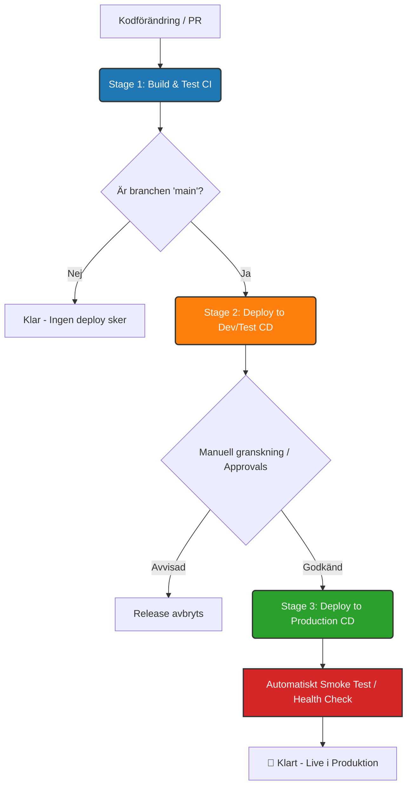

I den moderna DevOps-världen räcker det inte längre med att bara ha applikationskoden under versionshantering. Att klicka sig fram i grafiska gränssnitt för att bygga bygg- och driftsättningsflöden – så kaldade *Classic Release Pipelines* – är ett föråldrat arbetssätt som skapar underhållsskulder, bristande spårbarhet och konfigurationsavvikelser (configuration drift).

För att bygga en riktigt skarp, robust och automatiserad release- och deploy-pipeline i Azure DevOps bör du helt överge det gamla grafiska gränssnittet och fullt ut satsa på **YAML Multi-stage Pipelines**. 

Med detta tillvägagångssätt tillämpar du principerna för **Pipeline as Code (PaC)**. Hela din CI/CD-arkitektur deklareras i en textfil som versionshanteras i ditt Git-repository, precis som din vanliga C#- eller .NET-kod. Det innebär kodgranskning (Pull Requests) för infrastrukturändringar, fullhistorik och enkel återställning.

<!--more-->

Här är den kompletta arkitekturritningen och guiden för hur du sätter upp en smart, säker och enterprise-redo multi-stage pipeline.

---

## Arkitekturen: Multi-stage YAML-strukturen

En modern pipeline i Azure DevOps är hierarkiskt uppbyggd för att ge maximal struktur och flexibilitet:

1. **Stages (Etapper):** De övergripande faserna i din livscykel (t.ex. *Build*, *Deploy to Dev*, *Deploy to Production*). En stage fungerar som en isolerad exekveringsenhet som ofta representerar en miljö eller en logisk fas.
2. **Jobs (Jobb):** Varje Stage innehåller ett eller flera jobb. Jobb körs på en specifik agent (t.ex. en Linux- eller Windows-maskin) och kan köras parallellt om inget annat anges.
3. **Steps (Steg/Tasks):** Den lägsta nivån i hierarkin. Det är de faktiska kommandona eller färdiga uppgifterna (Tasks) som exekveras linjärt inuti ett jobb – exempelvis att återställa NuGet-paket, kompilera kod eller köra ett skript.

### Vårt automatiserade livscykelflöde

Det smarta flödet vi ska bygga är uppdelat i tre tydliga etapper och styrs av automatiserade villkor och manuella godkännanden:



*   **Stage 1: Build & Test (CI):** Kompilerar koden, kör enhetstester (inklusive validering av arkitektur och eventuella utgångna feature flags) samt paketerar och sparar byggartefakten. Denna körs på *alla* brancher och Pull Requests för att garantera kodkvalitet.
*   **Stage 2: Deploy to Dev/Test (CD):** Driftsätter automatiskt applikationen till utvecklingsmiljön. Detta steg är villkorat till att exekveras *endast* när kod har mergats in i huvudbranchen (`main`).
*   **Stage 3: Deploy to Production (CD):** Driftsätter applikationen till produktion. Denna etapp har strikta miljöskydd som kräver manuellt godkännande (Approvals) av behöriga personer och avslutas med ett automatiserat röktest (*Smoke Test*) för att verifiera driften.

---

## Komplett YAML-mall: `azure-pipelines.yml`

Här är ett produktionsklart och optimerat exempel på hur du strukturerar upp en modern pipeline för en .NET-applikation (t.ex. ASP.NET Core) mot Azure App Service.

```yaml
trigger:
  branches:
    include:
      - main

pool:
  vmImage: 'ubuntu-latest'

stages:

# =========================================================================
# STAGE 1: BUILD AND TEST (Continuous Integration)
# =========================================================================
- stage: Build
  displayName: '🚀 Build and Test Application'
  jobs:
  - job: BuildJob
    displayName: 'Compile, Test & Package'
    steps:
    - task: DotNetCoreCLI@2
      displayName: '📦 Restore NuGet Packages'
      inputs:
        command: 'restore'
        feedsToUse: 'select'

    - task: DotNetCoreCLI@2
      displayName: '🏗️ Build Solution (Release)'
      inputs:
        command: 'build'
        arguments: '--configuration Release'

    # Kör alla enhetstester och samla in testresultat
    - task: DotNetCoreCLI@2
      displayName: '🧪 Run Unit Tests'
      inputs:
        command: 'test'
        arguments: '--configuration Release --no-build'

    - task: DotNetCoreCLI@2
      displayName: '📂 Publish Web Application'
      inputs:
        command: 'publish'
        publishWebProjects: true
        arguments: '--configuration Release --output $(Build.ArtifactStagingDirectory)'
        zipAfterPublish: true

    - publish: $(Build.ArtifactStagingDirectory)
      artifact: drop
      displayName: '📤 Upload Artifact to Pipeline Storage'

# =========================================================================
# STAGE 2: DEPLOY TO DEV/TEST (Continuous Deployment)
# =========================================================================
- stage: DeployDev
  displayName: '🛠️ Deploy to Dev Environment'
  dependsOn: Build
  # Säkerställ att vi bara deployar till Dev om bygget lyckades och vi befinner oss på main-branchen
  condition: and(succeeded(), eq(variables['Build.SourceBranch'], 'refs/heads/main'))
  jobs:
  - deployment: DeployDevJob
    displayName: 'Deploy to Azure Dev App Service'
    environment: 'Development' # Kopplar till Azure DevOps Environment med dess regler
    strategy:
      runOnce:
        deploy:
          steps:
          - download: current
            artifact: drop
            displayName: '📥 Download Pipeline Artifacts'

          - task: AzureRmWebAppDeployment@4
            displayName: '🌐 Deploy Web App to Dev Slot'
            inputs:
              ConnectionType: 'AzureRM'
              azureSubscription: 'Azure-Dev-ServiceConnection'
              appType: 'webAppLinux'
              WebAppName: 'my-app-dev-sweden'
              packageForLinux: '$(Pipeline.Workspace)/drop/**/*.zip'

# =========================================================================
# STAGE 3: DEPLOY TO PRODUCTION (Continuous Deployment con Control)
# =========================================================================
- stage: DeployProd
  displayName: '💎 Deploy to Production'
  dependsOn: DeployDev
  condition: succeeded()
  jobs:
  - deployment: DeployProdJob
    displayName: 'Deploy to Azure Prod App Service'
    environment: 'Production' # Denna miljö har manuella "Approvals och Checks" aktiverade i UI
    strategy:
      runOnce:
        deploy:
          steps:
          - download: current
            artifact: drop
            displayName: '📥 Download Pipeline Artifacts'

          - task: AzureRmWebAppDeployment@4
            displayName: '🌐 Deploy Web App to Production'
            inputs:
              ConnectionType: 'AzureRM'
              azureSubscription: 'Azure-Prod-ServiceConnection'
              appType: 'webAppLinux'
              WebAppName: 'my-app-prod-sweden'
              packageForLinux: '$(Pipeline.Workspace)/drop/**/*.zip'

        # Smart Lifecycle Hook: Verifiera applikationens status direkt efter driftsättning
        routeTraffic:
          steps:
          - script: |
              echo "Inleder automatiserat röktest (Smoke Test) mot produktion..."
              STATUS=$(curl -s -o /dev/null -w "%{http_code}" https://my-app-prod-sweden.azurewebsites.net/health)

              if [ $STATUS -eq 200 ]; then
                echo "🚀 Produktion mår utmärkt! Health check svarade med HTTP 200."
              else
                echo "❌ Kritisk brist upptäckt! Applikationen svarar inte med HTTP 200. Statuskod: $STATUS"
                exit 1
              fi
            displayName: '🔍 Automated Smoke Test / Health Check'
```

---

## Tre smarta säkerhetsfunktioner du MÅSTE aktivera i Azure DevOps UI

En YAML-fil gör mycket, men för en komplett och enterprisesäker CI/CD-miljö behöver du kombinera din kod med plattformens inbyggda skyddsmekanismer. Här är tre inställningar du bör konfigurera direkt i Azure DevOps-gränssnittet:

### 1. Sätt upp "Environments" med Approvals (Granskning)
I YAML-koden ovan refererar vi till `environment: 'Production'`. Genom att explicit namnge en miljö skapas en logisk koppling till Azure DevOps resurshantering där vi kan applicera grindar (gates).

*   **Så gör du:** 
    1. Navigera till **Pipelines** ➔ **Environments** i Azure DevOps-menyn.
    2. Skapa en ny miljö och döp den till exakt `Production`.
    3. Klicka in på miljön, välj de tre prickarna uppe till höger och klicka på **Approvals and checks**.
    4. Lägg till **Approvals** och ange de teammedlemmar eller arkitekter som har mandat att godkänna releaser.
*   **Resultat:** När din pipeline har kört klart utvecklingsmiljön och når `DeployProd`-blocket stannar exekveringen upp. Systemet skickar notifieringar till godkännarna och fryser flödet i väntan på ett manuellt beslut. Inget skickas live av misstag.

### 2. Använd "Branch Policies" för att skydda din Main-branch
För att förhindra att utvecklare av misstag råkar committa kod direkt till `main` eller trycka ut otestade ändringar, måste branchen skyddas med policys.

*   **Så gör du:**
    1. Gå till **Repos** ➔ **Branches**.
    2. Klicka på de tre prickarna bredvid din `main`-branch och välj **Branch policies**.
    3. Aktivera **Require a minimum number of reviewers** (sätt förslagsvis till minst 1 eller 2 för godkänd Pull Request).
    4. Klicka på **Build validation** och lägg till en regel som pekar på din nya YAML-pipeline.
*   **Resultat:** När en utvecklare skapar en Pull Request mot `main` kommer Azure DevOps automatiskt att trigga din YAML-pipeline. Tack vare våra `condition`-satser i koden kommer *endast* `Stage 1: Build` (CI) att exekveras för att validera att koden kompilerar och att testerna är gröna. De efterföljande stegen (`DeployDev` och `DeployProd`) förblir helt låsta och körs först när Pull Requesten har godkänts, stängts och mergats in i `main`.

### 3. Proaktiv felhantering med automatiserade "Smoke Tests"
Notera det sista steget i vår produktionsetapp under hooken `routeTraffic`. Det är en elegant och kraftfull livscykelmekanism.

Många fel uppstår inte under själva byggfasen, utan vid uppstart i målmiljön – exempelvis på grund av felaktiga miljövariabler, felkonfigurerade Key Vault-anslutningar eller nätverksproblem mot en databas. Genom att implementera en `/health`-endpunkt i din .NET-applikation (förslagsvis via paketet `Microsoft.Extensions.Diagnostics.HealthChecks`) kan appen själv verifiera sina interna beroenden.

Om applikationen startar men kraschar internt kommer den inte att returnera statuskod `HTTP 200`. Pipelinen fångar upp detta via vår `curl`-sekvens, avbryter steget med en felkod (`exit 1`) och markerar jobbet som misslyckat. Detta ger omedelbar feedback till teamet innan några slutanvändare drabbas av driftstörningar.

---

## Sammanfattning
Att migrera från Classic Pipelines till YAML Multi-stage Pipelines ger dig full kontroll över din leveranskedja. Du får spårbarhet, ökad säkerhet via Branch Policies och robusta leveranser med hjälp av Environments och inbyggda Smoke Tests.

Genom att investera tid i att bygga upp din pipeline som kod lägger du grunden för en skalbar och modern DevOps-kultur.

---

## Referenser och fördjupning
För att läsa mer och fördjupa dig i Azure DevOps Pipelines och YAML-konfigurationer, rekommenderas följande officiella resurser:

*   [Officiell dokumentation för Azure Pipelines](https://learn.microsoft.com/azure/devops/pipelines/) – Den centrala hubben för allt som rör bygg- och releaseprocesser i Azure DevOps.
*   [Skapa din första Multi-stage Pipeline](https://learn.microsoft.com/azure/devops/pipelines/get-started/multi-stage-pipeline-tutorial) – En steg-för-steg-guide för att komma igång med YAML-baserade flerstegsflöden.
*   [Hantera Environments i Azure DevOps](https://learn.microsoft.com/azure/devops/pipelines/process/environments) – Detaljerad information om hur du konfigurerar miljöer, godkännanden (Approvals) och checks.
*   [Expressions och Conditions i YAML](https://learn.microsoft.com/azure/devops/pipelines/process/expressions) – Lär dig hur du bygger avancerade logiska villkor för när specifika jobb och etapper ska exekveras.
*   [Deployment Strategies (RunOnce, Canary, Rolling)](https://learn.microsoft.com/azure/devops/pipelines/process/deployment-jobs) – Fördjupning i hur du använder avancerade driftsättningsstrategier och livscykel-hooks som `routeTraffic` och `postRouteTraffic`.
moderna_azure_devops_release_pipelines-v2.md
Visar moderna_azure_devops_release_pipelines-v2.md.
