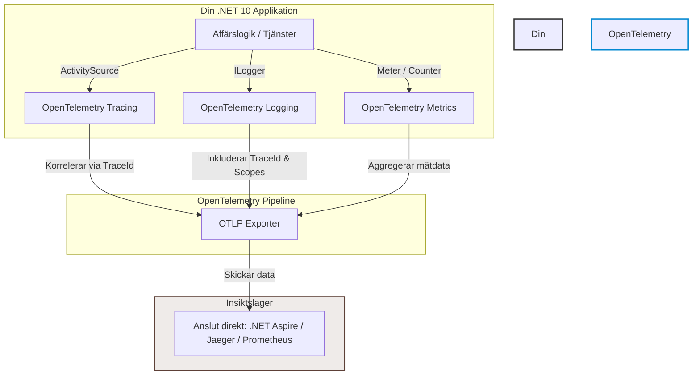

Att bygga distribuerade system och mikrotjänster utan ordentlig insyn är som att köra bil med förbundna ögon. När något går fel vill du inte leta febrilt i isolerade textfiler på fem olika servrar. Du vill ha en sammanhängande berättelse som visar *vem* som gjorde anropet, *vad* som hände och *varför* det tog tid.

I .NET 10 är **OpenTelemetry (OTel)** den absoluta guldstandarden för detta. Det är en öppen, leverantörsoberoende standard som gör att du kan samla in **Traces (spår)**, **Logs (loggar)** och **Metrics (mätvärden)** utan att låsa upp dig till specifika plattformar som Datadog eller Dynatrace.

I den här guiden bygger vi en komplett, produktionsredo observerbarhetspipeline i .NET 10 – från grundläggande arkitektur till smarta enrichers. När vi är klara är din applikation helt redo att sömlöst pluggas rakt in i verktyg som **.NET Aspire Dashboard**.

<!--more-->
---

## Arkitekturen: Hur allt hänger ihop

Innan vi dyker ned i koden är det viktigt att förstå flödet. Din applikation skapar diagnostikdata via .NET:s inbyggda klasser. OpenTelemetry lyssnar på dessa källor, paketerar datan och skickar den vidare via ett standardiserat protokoll (OTLP) till ditt valda instrumenteringsverktyg.



### De tre pelarna vi konfigurerar:

1. **Traces (Activity):** Ritar upp tidslinjen. Visar exakt hur lång tid varje metod och externt API-anrop tar.
2. **Logs (ILogger):** Berättar historien om specifika händelser. Korreleras automatiskt med den aktuella tidslinjen via ett unikt `TraceId`.
3. **Metrics (Meter):** Visar applikationens hälsa över tid (t.ex. antal hanterade ordrar per minut eller CPU-användning).

---

## Steg 1: Skippa magiska strängar – Central Diagnostik

Att hårdkoda namnen på dina spårningskällor runt om i applikationen leder till buggar. Vi skapar en central, statisk klass som håller koll på våra källor. Detta gör att både din affärslogik och din installationskod pratar exakt samma språk.

Skapa filen `ApplicationDiagnostics.cs`:

```csharp
using System.Diagnostics;
using System.Diagnostics.Metrics;

namespace EnterpriseTelemetry.Diagnostics;

public static class ApplicationDiagnostics
{
    // Namnet på tjänsten som identifierar oss i dashboards
    public const string ServiceName = "EnterpriseOrderApi";
    public const string ServiceVersion = "1.0.0";

    // Vår centrala källa för spårning (Tracing)
    public static class Orders
    {
        public const string SourceName = "Enterprise.Orders.Core";
        public static readonly ActivitySource Source = new(SourceName, ServiceVersion);
    }

    // Vår centrala källa för prestandamätning (Metrics)
    public static class Metrics
    {
        public const string MeterName = "Enterprise.Orders.Metrics";
        public static readonly Meter OrderMeter = new(MeterName, ServiceVersion);

        // Exempel på en global räknare för skapade ordrar
        public static readonly Counter<long> OrdersCreatedCounter =
            OrderMeter.CreateCounter<long>("orders.created.count", description: "Totalt antal skapade ordrar");
    }
}

```

### 🔍 Vad är det vi precis skapade? (Deep Dive i `ApplicationDiagnostics`)

Det är lätt att gå vilse bland alla nya begrepp. Låt oss bryta ner exakt vad klassen gör och varför den inte är en inbyggd standardklass:

`ApplicationDiagnostics` är en **egenutvecklad klass** (ett arkitekturmönster). Vi skapar den som en "singel källa till sanning" för att slippa sprida ut hårdkodade textsträngar i applikationen. Under huven använder den dock tre mycket viktiga och inbyggda .NET-klasser från namnrymden `System.Diagnostics`:

* **`ActivitySource` (Spårningskällan):** Det här är själva "radiostationen". Den är tätt kopplad till OpenTelemetry. När din applikation gör något intressant säger vi till denna källa att starta en ny aktivitet. Genom att ange namnet `Enterprise.Orders.Core` kan OpenTelemetry i `Program.cs` enkelt ställa in radion på rätt frekvens och lyssna efter spår.
* **`Meter` (Mätarklassen):** Detta är .NET:s inbyggda motor för att samla in numerisk data över tid. Det fungerar som ett paraply eller en samlingspunkt för alla dina specifika prestandamätare inom en viss domän.
* **`Counter<T>` (Räknaren):** En specifik typ av mätare som bara kan räkna uppåt (eller nollställas). Perfekt för affärshändelser som *"antal lagda ordrar"*, *"antal skickade mejl"* eller *"antal felaktiga inloggningar"*.

Genom att paketera dessa i en central klass får vi **typsäkerhet**. Om du råkar stava fel på en rå textsträng i en traditionell setup märker du det först när spåren saknas i din dashboard. Här märker kompilatorn det direkt innan du ens hunnit provköra koden.

---

## Steg 2: Skapa Middleware för automatisk berikning (Enrichment)

För att loggarna och spåren ska bli riktigt värdefulla i en enterprise-miljö behöver vi veta *kontexten* – till exempel vilket kund-ID (`tenant.id`) eller användar-ID som triggade anropet.

Vi bygger en anpassad ASP.NET Core Middleware som använder **Primary Constructors** för att plocka ut dessa claims från användarens token och stämpla dem på den aktiva spårningen samt via **Baggage** (metadata som automatiskt följer med i HTTP-headers till nästa mikrotjänst).

Skapa filen `TelemetryEnrichmentMiddleware.cs`:

```csharp
using System.Diagnostics;
using System.Security.Claims;
using Microsoft.AspNetCore.Http;
using OpenTelemetry;

namespace EnterpriseTelemetry.Middleware;

public class TelemetryEnrichmentMiddleware(RequestDelegate next)
{
    public async Task InvokeAsync(HttpContext context)
    {
        // Hämta aktiviteten som ASP.NET Core redan har startat för detta HTTP-anrop
        Activity? currentActivity = Activity.Current;

        if (currentActivity is not null && context.User.Identity?.IsAuthenticated == true)
        {
            // Extrahera information från användarens Claims (t.ex. från en JWT-token)
            string? userId = context.User.FindFirst(ClaimTypes.NameIdentifier)?.Value;
            string? tenantId = context.User.FindFirst("tenant_id")?.Value;

            if (userId is not null)
            {
                // Sätt en lokal tagg (syns på denna specifika spårning)
                currentActivity.SetTag("app.user.id", userId);
                // Sätt Baggage (skickas vidare över nätverket till nästa mikrotjänst)
                Baggage.SetBaggage("user.id", userId);
            }

            if (tenantId is not null)
            {
                currentActivity.SetTag("app.tenant.id", tenantId);
                Baggage.SetBaggage("tenant.id", tenantId);
            }
        }

        // Fortsätt till nästa steg i applikationens pipeline
        await next(context);
    }
}

```

---

## Steg 3: Sy ihop allt i `Program.cs`

Nu använder vi .NET 10:s strömlinjeformade builder-mönster för att konfigurera OpenTelemetry. Vi slår på automatisk instrumentering for inkommande HTTP-anrop (`AspNetCore`), utgående anrop (`HttpClient`) samt konfigurerar loggning och mätvärden.

Ersätt innehållet i din `Program.cs`:

```csharp
using System.Diagnostics;
using EnterpriseTelemetry.Diagnostics;
using EnterpriseTelemetry.Middleware;
using EnterpriseTelemetry.Services;
using OpenTelemetry.Logs;
using OpenTelemetry.Metrics;
using OpenTelemetry.Resources;
using OpenTelemetry.Trace;

var builder = WebApplication.CreateBuilder(args);

// 1. Konfigurera gemensam resursinformation för all telemetri
var resourceBuilder = ResourceBuilder.CreateDefault()
    .AddService(ApplicationDiagnostics.ServiceName, serviceVersion: ApplicationDiagnostics.ServiceVersion)
    .AddEnvironmentVariableDetector();

// 2. Konfigurera OpenTelemetry (Traces & Metrics)
builder.Services.OpenTelemetry()
    .WithResources(res => res.AddResource(resourceBuilder.Build()))
    .WithTracing(tracing =>
    {
        tracing
            .AddSource(ApplicationDiagnostics.Orders.SourceName) // Lyssna på vår anpassade källa
            .AddAspNetCoreInstrumentation(options => options.RecordException = true)
            .AddHttpClientInstrumentation()
            .AddOtlpExporter(); // Skickar data via standard OTLP (t.ex. till Aspire Dashboard)
    })
    .WithMetrics(metrics =>
    {
        metrics
            .AddMeter(ApplicationDiagnostics.Metrics.MeterName) // Lyssna på vår mätarklass
            .AddAspNetCoreInstrumentation()
            .AddHttpClientInstrumentation()
            .AddRuntimeInstrumentation() // CPU, minne, trådar helt gratis
            .AddOtlpExporter();
    });

// 3. Konfigurera OpenTelemetry Logging
builder.Logging.ClearProviders(); // Rensa standardleverantörer om du vill styra helt själv
builder.Logging.AddOpenTelemetry(options =>
{
    options.SetResourceBuilder(resourceBuilder);
    options.IncludeFormattedMessage = true;
    options.IncludeScopes = true; // Mycket viktigt! Gör att LogScopes och Baggage följer med i loggen
    options.ParseStateValues = true;
    options.AddOtlpExporter();
});

// Registrera våra egna tjänster
builder.Services.AddScoped<OrderProcessingService>();

var app = builder.Build();

app.UseHttpsRedirection();

// Registrera vår middleware EFTER auth men FÖRE endpoints
app.UseAuthentication();
app.UseAuthorization();
app.UseMiddleware<TelemetryEnrichmentMiddleware>();

// Enkel endpoint för att testa flödet
app.MapPost("/api/orders", async (OrderProcessingService orderContext) =>
{
    var orderId = Guid.NewGuid();
    await orderContext.CreateOrderAsync(orderId);
    return Results.Accepted($"/api/orders/{orderId}", new { Id = orderId });
});

app.Run();

```

---

## Steg 4: Använd i din Affärslogik (Med Primary Constructors)

Nu när infrastrukturen är på plats kan vi fokusera på att skriva vacker affärskod. Vi använder en **Primary Constructor** för att enkelt få tillgång till `ILogger` och plockar ut vår `ActivitySource` helt statiskt för maximal prestanda.

Skapa filen `OrderProcessingService.cs`:

```csharp
using System.Diagnostics;
using EnterpriseTelemetry.Diagnostics;

namespace EnterpriseTelemetry.Services;

// Snygg och ren klassdefinition tack vare Primary Constructor i modern C#
public class OrderProcessingService(ILogger<OrderProcessingService> logger)
{
    public async Task CreateOrderAsync(Guid orderId)
    {
        // Starta en aktivitet (Span) för den här operationen.
        // Om ingen dashboard lyssnar blir 'activity' null automatiskt vilket sparar CPU/Minne.
        using Activity? activity = ApplicationDiagnostics.Orders.Source.StartActivity("CreateOrder");

        // Sätt sökbara taggar för spårningen
        activity?.SetTag("order.id", orderId.ToString());

        // Skriv en strukturerad logg. TraceId injiceras magiskt i bakgrunden!
        logger.LogInformation("Initierar skapande av order {OrderId}.", orderId);

        try
        {
            // Simulera validering och databasarbete
            await Task.Delay(80);
            activity?.AddEvent(new ActivityEvent("OrderValidatedInDatabase")); // Tidsstämplat delsteg

            await Task.Delay(40);

            // Öka vår globala Metric-räknare
            ApplicationDiagnostics.Metrics.OrdersCreatedCounter.Add(1,
                new KeyValuePair<string, object?>("order.status", "Success"));

            logger.LogInformation("Order {OrderId} sparades framgångsrikt i systemet.", orderId);
        }
        catch (Exception ex)
        {
            // Om något kraschar flaggar vi spåret som korrupt och loggar detaljerna
            activity?.SetStatus(ActivityStatusCode.Error, ex.Message);
            activity?.RecordException(ex);

            logger.LogError(ex, "Ett allvarligt fel inträffade vid skapande av order {OrderId}.", orderId);
            throw;
        }
    }
}

```

---

## Nästa steg: Koppla på .NET Aspire

Det fina med den här implementationen är att du har byggt applikationen helt enligt moln-standard (Cloud-Native). Du använder inga proprietära eller hårdkodade SDK:er.

Eftersom vi använder `.AddOtlpExporter()` lyssnar applikationen efter standardiserade miljövariabler (som `OTEL_EXPORTER_OTLP_ENDPOINT`). Det betyder att om du senare vill lägga till **.NET Aspire** till din lösning, behöver du bara lägga till ditt projekt i en Aspire AppHost. Aspire kommer då automatiskt att injicera rätt adresser, och din applikation kommer omedelbart att börja strömma spår, mätvärden och loggar rakt in i den prisbelönta **Aspire Dashboard** utan att du behöver ändra en enda rad kod i det vi just skrivit!

---

## Läs mer och fördjupa dig

För att gräva ännu djupare i hur .NET:s diagnostikmotor och OpenTelemetry fungerar, rekommenderas följande officiella resurser:

* [Microsoft Learn: .NET Observability med OpenTelemetry](https://learn.microsoft.com/en-us/dotnet/core/diagnostics/observability-with-otel)
* [OpenTelemetry.io: Officiell dokumentation för .NET C#](https://opentelemetry.io/docs/languages/net/)
* [Microsoft Learn: Introduktion till .NET Aspire Dashboard](https://www.google.com/search?q=https://learn.microsoft.com/en-us/dotnet/aspire/fundamentals/dashboard)
* [Microsoft Learn: Förstå loggningsomfång (Log Scopes) i .NET](https://www.google.com/search?q=https://learn.microsoft.com/en-us/dotnet/core/extensions/logging%3Ftabs%3Dcommand-line%23log-scopes)
