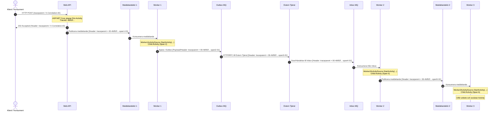

När vi bygger mikrotjänster, händelsestyrda system och bakgrundsarbetare i .NET räcker det inte med vanliga loggar. Vi behöver **Distributed Tracing** för att kunna följa exakt hur en förfrågan rör sig från ett externt HTTP-anrop, genom meddelandeköer, mönster som Outbox/Inbox, externa tjänster och slutligen behandlas av asynkrona workers.

<!--more-->
---

I hjärtat av modern spårning i .NET (.NET 5+) hittar vi **`ActivitySource`**. Det är själva motorn och startpunkten för all spårning i koden.

I denna artikel går vi igenom hur du använder `ActivitySource` som utgångspunkt för spårning, hur W3C Trace Context fungerar över meddelandeköer, samt hur du uppfyller **DIGG:s REST API-profil**.

---

## 1. `ActivitySource` – Startpunkten för all spårning i .NET

Många utvecklare är vana vid begreppet *Span* från OpenTelemetry. I .NET-världen motsvaras en *Span* av klassen `Activity`, men du skapar **aldrig** en `Activity` direkt med `new Activity()`. 

Istället är **`ActivitySource`** din startpunkt (motsvarande OpenTelemetrys `Tracer`). Den fungerar som en fabrik som skapar och startar dina aktiviteter.

### Varför är `ActivitySource` så viktig?

1. **Startpunkt i koden:** Det är genom `ActivitySource.StartActivity()` som du startar en ny spårningsenhet.
2. **Prestanda:** Om ingen lyssnar på dina spår (t.ex. om OpenTelemetry SDK inte är aktiverat) returnerar `StartActivity()` helt enkelt `null`. Det innebär noll minnesallokering och minimal prestandapåverkan.
3. **Namnområde (Tracing Source):** Du skapar oftast en statisk instans per modul/tjänst, vilket gör det enkelt att filtrera och konfigurera vilka delar av din applikation som ska spåras.

```csharp
// 1. Skapa din ActivitySource (startpunkten för komponenten)
private static readonly ActivitySource MyActivitySource = new("MyCompany.OrderService");

public async Task ProcessOrder()
{
    // 2. Starta en spårningsaktivitet
    using var activity = MyActivitySource.StartActivity("ProcessOrderStep");
    
    // Om någon lyssnar är activity != null och vi kan lägga till taggar
    activity?.SetTag("order.id", 12345);

    // Utför arbete...
} // 3. När activity avyttras (dispose) stängs tidsmätningen automatiskt!
```

---

## 2. Vad säger DIGG:s REST API-profil?

Myndigheten för digital förvaltning (DIGG) ställer tydliga krav på spårbarhet i offentlig sektors API:er.

1. **W3C Trace Context som primär standard:**
   Skicka och ta emot spårningskontext via den officiella W3C-headern `traceparent`.
2. **Hantering av `X-Correlation-ID`:**
   Om externa klienter skickar ett äldre eller anpassat `X-Correlation-ID`, ska detta fångas upp i ditt Web API och läggas till som en tagg (`correlation.id`) på din `Activity`. Själva spårningskedjan driver du dock vidare internt via W3C `traceparent`.
3. **Respons-headers:**
   Returnera alltid spårnings-ID (`traceparent` och/eller `X-Correlation-ID`) i HTTP-responsen så att konsumenten kan uppge ID:t vid felrapportering.

---

## 3. ID-formatet: W3C `traceparent`

När `ActivitySource.StartActivity()` anropas genereras automatiskt unika ID:n enligt W3C-standarden. Formatet som skickas mellan köer och tjänster ser ut så här:

$$\text{version}-\text{traceid}-\text{parentid}-\text{traceflags}$$

**Exempel:**
`00-4bf92f3577b34da6a3ce929d0e0e4736-00f067aa0ba902b7-01`

* **`version`**: `00` (W3C-standard).
* **`traceid`**: 128-bitars unikt ID. Förblir **exakt samma** genom Web API, alla workers och externa tjänster.
* **`parentid`**: 64-bitars ID för den specifika delaktiviteten (SpanId) som skickade meddelandet.
* **`traceflags`**: `01` anger att spåret samlas in/samplas.

---

## 4. Arkitektur & Flödesdiagram

Sekvensdiagrammet nedan visar hur `ActivitySource` i varje steg skapar nya underaktiviteter (child spans) med hjälp av den spårningskontext (`traceparent`) som skickas med i meddelandenas metadata:



---

## 5. Implementering i C#

Låt oss se hur vi bygger detta i koden. Vi skapar först en hjälpklass för **Context Propagation** (Inject & Extract).

### Hjälpklass för spårningskontext

```csharp
using System.Diagnostics;

public static class TracingHelpers
{
    // Inject: Hämtar Activity.Current och sätter traceparent i meddelandets headers
    public static void InjectTraceContext(IDictionary<string, string> headers)
    {
        var currentActivity = Activity.Current;
        if (currentActivity == null) return;

        // Activity.Id är automatiskt formaterat enligt W3C traceparent
        headers["traceparent"] = currentActivity.Id;

        if (!string.IsNullOrEmpty(currentActivity.TraceStateString))
        {
            headers["tracestate"] = currentActivity.TraceStateString;
        }
    }

    // Extract: Läser traceparent från headers och konverterar till ActivityContext
    public static ActivityContext ExtractTraceContext(IReadOnlyDictionary<string, string> headers)
    {
        if (headers.TryGetValue("traceparent", out var traceparent) && !string.IsNullOrWhiteSpace(traceparent))
        {
            headers.TryGetValue("tracestate", out var tracestate);
            return ActivityContext.Parse(traceparent, tracestate);
        }

        return default;
    }
}
```

---

### Steg 1: Web API (Mottagning & DIGG-stöd)

ASP.NET Core har en inbyggd `ActivitySource` för HTTP-anrop. Vi lägger till ett middleware för att hantera `X-Correlation-ID` samt sätta svar-headers enligt DIGG.

```csharp
public class DiggTracingMiddleware
{
    private readonly RequestDelegate _next;

    public DiggTracingMiddleware(RequestDelegate next) => _next = next;

    public async Task InvokeAsync(HttpContext context)
    {
        var currentActivity = Activity.Current;

        // Om klienten skickade X-Correlation-ID, spara det som tagg
        if (context.Request.Headers.TryGetValue("X-Correlation-ID", out var correlationId))
        {
            currentActivity?.SetTag("correlation.id", correlationId.ToString());
        }

        // Returnera spårnings-headers till klienten när svaret skickas
        context.Response.OnStarting(() =>
        {
            if (currentActivity != null)
            {
                context.Response.Headers["traceparent"] = currentActivity.Id;
                if (correlationId.Count > 0)
                {
                    context.Response.Headers["X-Correlation-ID"] = correlationId;
                }
            }
            return Task.CompletedTask;
        });

        await _next(context);
    }
}
```

När Web API skickar meddelandet vidare till **Meddelandekö 1**:

```csharp
[ApiController]
[Route("api/[controller]")]
public class OrdersController : ControllerBase
{
    private readonly IQueueService _queueService;

    public OrdersController(IQueueService queueService) => _queueService = queueService;

    [HttpPost]
    public async Task<IActionResult> CreateOrder([FromBody] OrderRequest request)
    {
        var headers = new Dictionary<string, string>();
        
        // Injectera den aktiva spårningskontexten
        TracingHelpers.InjectTraceContext(headers);

        await _queueService.PublishAsync("queue-1", request, headers);

        return Accepted();
    }
}
```

---

### Steg 2 & 3: Worker 1 & Outbox-mönstret

I Worker 1 definierar vi vår egen `ActivitySource` som startpunkt för arbetarens spårning. När meddelandet konsumeras skickar vi med den extraherade `ActivityContext` till `StartActivity`.

```csharp
public class Worker1
{
    // ActivitySource är startpunkten för Worker 1:s spårning
    private static readonly ActivitySource WorkerSource = new("MyCompany.Services.Worker1");
    private readonly IOutboxRepository _outbox;

    public Worker1(IOutboxRepository outbox) => _outbox = outbox;

    public async Task ProcessQueueMessage(QueueMessage message)
    {
        // 1. Extrahera föräldrakontexten från meddelandets headers
        ActivityContext parentContext = TracingHelpers.ExtractTraceContext(message.Headers);

        // 2. Starta en ny Activity via vår ActivitySource med parentContext
        using var activity = WorkerSource.StartActivity(
            "Worker1.ProcessMessage", 
            ActivityKind.Consumer, 
            parentContext);

        activity?.SetTag("message.id", message.Id);

        // 3. Utför arbete och spara till Outbox med ny traceparent
        var outboxHeaders = new Dictionary<string, string>();
        TracingHelpers.InjectTraceContext(outboxHeaders);

        await _outbox.SaveAsync(new OutboxMessage
        {
            Payload = message.Body,
            HeadersJson = JsonSerializer.Serialize(outboxHeaders)
        });
    }
}
```

---

### Steg 4, 5 & 6: Outbox $\rightarrow$ Extern Tjänst $\rightarrow$ Inbox $\rightarrow$ Worker 2 $\rightarrow$ Worker 3

Samma mönster upprepas genom hela den asynkrona kedjan:

1. **Outbox Processor:** Läser Outbox-tabellen, skickar HTTP-anrop till den **Externa Tjänsten** med `traceparent` i HTTP-headern.
2. **Worker 2 (Inbox Consumer):** Har sin egen `ActivitySource`:

```csharp
public class Worker2
{
    private static readonly ActivitySource Worker2Source = new("MyCompany.Services.Worker2");

    public async Task ProcessInboxMessage(InboxMessage message)
    {
        var parentContext = TracingHelpers.ExtractTraceContext(message.Headers);

        using var activity = Worker2Source.StartActivity("Worker2.ProcessInbox", ActivityKind.Consumer, parentContext);

        // Utför arbete...
        
        var queue2Headers = new Dictionary<string, string>();
        TracingHelpers.InjectTraceContext(queue2Headers);
        await _queue2.PublishAsync(message.Body, queue2Headers);
    }
}
```

3. **Worker 3 (Slutlig behandling):**

```csharp
public class Worker3
{
    private static readonly ActivitySource Worker3Source = new("MyCompany.Services.Worker3");

    public async Task CompleteProcess(QueueMessage message)
    {
        var parentContext = TracingHelpers.ExtractTraceContext(message.Headers);

        using var activity = Worker3Source.StartActivity("Worker3.Finalize", ActivityKind.Consumer, parentContext);

        // Slutgiltigt arbete utförs här
        activity?.SetTag("status", "success");
    }
}
```

---

## 6. Källor och vidare läsning

För att läsa mer och fördjupa dig i koncepten och de bakomliggande standarderna finns officiella källor nedan:

### Microsoft Learn
* [Distributed Tracing Concepts (.NET)](https://learn.microsoft.com/en-us/dotnet/core/diagnostics/distributed-tracing-concepts) – Översikt över hur `ActivitySource` och `Activity` fungerar i .NET.
* [Distributed Tracing Instrumentation Walkthrough](https://learn.microsoft.com/en-us/dotnet/core/diagnostics/distributed-tracing-instrumentation-walkthroughs) – Officiell guide för hur du skapar och använder `ActivitySource` i dina egna klasser och bibliotek.
* [DistributedContextPropagator API Reference](https://learn.microsoft.com/en-us/dotnet/api/system.diagnostics.distributedcontextpropagator) – Dokumentation av klassen i .NET som hanterar Inject och Extract av W3C-headers.

### DIGG (Myndigheten för digital förvaltning)
* [DIGG:s Riktlinjer för REST API:er](https://www.digg.se/utveckling-och-innovation/oppna-data-och-oppen-kod/ramverk-och-riktlinjer) – DIGG:s ramverk för standardisering och spårbarhet i offentlig sektors gränssnitt.
* [Sveriges Dataportal – API-profil](https://dataportal.se/) – Specifikationer och riktlinjer gällande API-design och interoperabilitet.

### Standarder & OpenTelemetry
* [W3C Trace Context Specification](https://www.w3.org/TR/trace-context/) – Den officiella standarden för `traceparent` och `tracestate`.
* [OpenTelemetry .NET SDK på GitHub](https://github.com/open-telemetry/opentelemetry-dotnet) – Dokumentation och exporterare för OTLP, Jaeger, Zipkin med flera.

### Loggning & Serilog
* [Serilog Enrichers for OpenTelemetry / Activity](https://github.com/serilog/serilog-enrichers-span) – Hur du automatiskt berikar dina Serilog-loggar med `TraceId` och `SpanId`.
* [SerilogTracing](https://github.com/serilog-tracing/serilog-tracing) – Bibliotek för att skriva ut spårningsdata direkt via Serilog.