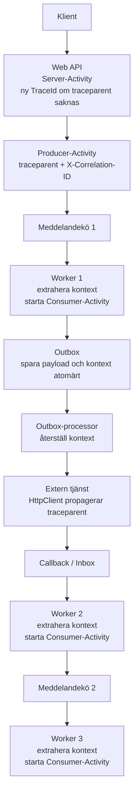

När ett flöde passerar ett Web API, en meddelandekö, en outbox och flera workers räcker det inte att läsa en logg i taget. Med distribuerad spårning kan vi följa arbetet genom flera processer och se var tid går eller var ett fel uppstår.

Den här artikeln visar hur du använder .NET:s `ActivitySource` tillsammans med OpenTelemetry och W3C Trace Context. Vi går från grundbegreppen till propagering över HTTP och meddelandeköer, och skiljer tydligt på ett `trace-id` och ett eget `X-Correlation-ID`.

<!--more-->
---

## 1. Grundmodellen: trace, Activity och ID:n

En **trace** är hela det sammanhängande arbetet, till exempel behandlingen av en beställning från HTTP-anrop till sista worker. En trace består av mindre arbetsenheter som kallas **spans** i OpenTelemetry. I .NET representeras en span av `System.Diagnostics.Activity`.

Varje Activity hör normalt till samma trace som sina föräldrar, men har ett eget span-ID. Parent-child-relationerna bildar ett träd som kan sträcka sig över process- och systemgränser.

Det ger tre ID:n som är lätta att blanda ihop:

| Begrepp | Betydelse |
| --- | --- |
| `TraceId` | Identifierar den övergripande tracen. Samma värde används normalt i alla dess spans. |
| `SpanId` | Identifierar en enskild Activity, till exempel ett HTTP-anrop eller arbetet i en worker. |
| `ParentSpanId` | Identifierar den Activity som startade den aktuella. Det är förälderns `SpanId`. |

### Är `TraceId` samma sak som ett correlation ID?

Inte automatiskt. `TraceId` är ett fält i W3C Trace Context och identifierar en teknisk trace. Ett `X-Correlation-ID` är däremot en egen applikationsheader vars betydelse och format bestäms av systemet eller API-kontraktet.

Ett `TraceId` fungerar ofta som korrelationsnyckel när du söker i spår och loggar. Det gör det inte automatiskt till samma sak som ett inkommande `X-Correlation-ID`. Behöver du båda, behåll dem som separata värden och logga exempelvis `Activity.TraceId` och `correlation.id`. Slå bara ihop dem om ni uttryckligen har bestämt att de har samma betydelse och följer W3C:s krav på ett trace-ID.

```text
traceparent:      00-4bf92f3577b34da6a3ce929d0e0e4736-00f067aa0ba902b7-01
X-Correlation-ID: 6f9619ff-8b86-d011-b42d-00cf4fc964ff
```

Här är det långa hexadecimala värdet trace-ID:t. GUID:t är ett separat, valfritt ID för verksamhetens eller API:ets korrelation.

Ett internt `correlation-id` i GUID-format är ett vanligt och fungerande val. Skapa det en gång när ärendet eller flödet kommer in och behåll samma värde när arbetet skickas vidare genom köer, retries och workers. Skapa inte ett nytt correlation-id i varje tjänst. Propagera det separat, exempelvis som `X-Correlation-ID` i HTTP och som en egen meddelandeheader.

Låt tracing-systemet samtidigt hantera `TraceId`. Ett ärende kan omfatta flera traces, till exempel när en retry eller senare callback startar en ny trace. Då hjälper GUID:t dig att hitta alla relaterade traces, medan varje W3C `TraceId` identifierar en enskild trace. Behandla inkommande ID:n som extern data: validera format och längd, och lägg aldrig personuppgifter eller hemligheter i ID:t. Undvik också att använda dessa högkardinalitetsvärden som metric-labels.

Använd inte ett vanligt `Guid.ToString("D")` direkt som W3C `trace-id`: D-formatet innehåller bindestreck och är inte ett giltigt W3C-fält. Även om GUID:t skrivs utan bindestreck är det bättre att låta tracing-systemet äga `TraceId` och hålla korrelations-ID:t separat. Då kan retries, sampling och nya traces fungera utan att verksamhets-ID:t styr tracingens livscykel.

## 2. W3C `traceparent` – kontexten som följer med anropet

`traceparent` är inte bara ett trace-ID. Det är W3C Trace Context-headern som bär information så att nästa komponent kan fortsätta tracen och skapa en egen span.

```text
traceparent: {version}-{trace-id}-{parent-id}-{trace-flags}
```

Exempel:

```text
traceparent: 00-4bf92f3577b34da6a3ce929d0e0e4736-00f067aa0ba902b7-01
```

| Fält | Betydelse |
| --- | --- |
| `version` | Formatversion. Den vanligaste och nuvarande versionen är `00`. |
| `trace-id` | 16 byte (32 hextecken), samma genom tracen så länge tracen inte uttryckligen startas om. Nollvärdet är ogiltigt. |
| `parent-id` | 8 byte (16 hextecken), ID:t för anroparens span. Det ändras när en ny komponent skapar och propagerar sin span. |
| `trace-flags` | Flaggor. I version `00` anger biten `01` att anroparen har markerat tracen som samplad; det är inte en garanti för att all telemetri finns lagrad. |

När API:t tar emot ett anrop med `traceparent` skapar dess tracing-instrumentering en server-Activity med samma `TraceId` och ett eget `SpanId`. När API:t anropar en annan tjänst skickas kontexten vidare med den aktuella spanen som förälder. Därför är `trace-id` normalt oförändrat medan `parent-id` byts ut längs kedjan.

I .NET 5 och senare används W3C-formatet som standard. Låt ramverket eller OpenTelemetrys propagator skapa och läsa headern i stället för att själv bygga ihop strängen.

## 3. `ActivitySource` skapar spans – OpenTelemetry samlar in dem

`ActivitySource` är API:t som din egen kod använder för att skapa Activities. Den registrerar inte i sig någon exporter eller backend. För att få spans insamlade behöver applikationen en listener, vanligtvis OpenTelemetry SDK, som prenumererar på källan.

Om ingen listener lyssnar kan `StartActivity()` returnera `null`. Därför ska kod som sätter taggar hantera att Activity saknas med `activity?.SetTag(...)`. Att lägga till en `ActivitySource` utan att registrera dess namn i OpenTelemetry räcker alltså inte för att få ut spans.

Ett förenklat exempel för en ASP.NET Core-tjänst:

```csharp
builder.Services.AddOpenTelemetry()
    .ConfigureResource(resource => resource.AddService("MyCompany.OrderService"))
    .WithTracing(tracing => tracing
        .AddAspNetCoreInstrumentation()
        .AddHttpClientInstrumentation()
        .AddSource("MyCompany.OrderService")
        .AddOtlpExporter());
```

Installera de OpenTelemetry-paket som motsvarar ASP.NET Core-instrumenteringen, `HttpClient`-instrumenteringen och OTLP-exportern. Konfigurera även var OTLP-exportern ska skicka telemetrin. Varje worker-process behöver motsvarande SDK-konfiguration och sina egna `ActivitySource`-namn registrerade.

Skapa vanligtvis en källa per komponent eller bibliotek och återanvänd den:

```csharp
private static readonly ActivitySource OrderSource = new("MyCompany.OrderService");

public async Task ProcessOrderAsync()
{
    using var activity = OrderSource.StartActivity("order.process");
    activity?.SetTag("order.id", "8472");

    await DoWorkAsync();
}
```

När Activity avyttras avslutas den. OpenTelemetry kan då exportera dess varaktighet, status och taggar enligt konfigurationen.

---

## 4. Vad säger DIGG:s REST API-profil?

DIGG:s REST API-profil 2.0.0 har ett särskilt kravområde för spårbarhet och korrelation. För API:er som följer profilen är W3C Trace Context den interoperabla standarden mellan system:

1. API:er ska stödja W3C-spårning och acceptera inkommande `traceparent`.
2. De ska propagera spårningsinformationen vidare vid anrop till andra system.
3. Om `traceparent` saknas ska API:t initiera en ny spårkedja.
4. API:t bör inkludera `traceparent` i HTTP-svaret, så klienten kan använda värdet vid felsökning.
5. `tracestate` kan användas för organisationsspecifik spårningsinformation. Alternativa ID:n, exempelvis `X-Correlation-ID` eller `X-Request-ID`, kan vara komplement men ersätter inte `traceparent` mellan system.

> Kontrollera alltid den version av profilen som gäller för ditt API. I version 2.0.0 är `traceparent` den standardiserade spårningsmekanismen; profilen beskriver inte `X-Correlation-ID` som en fallback som ersätter den.

Om applikationen också tar emot ett eget `X-Correlation-ID` kan du spara det som separat tagg i Activity och i loggar. Sök sedan på trace-ID när du felsöker en teknisk trace och på korrelations-ID när du följer ett ärende eller en verksamhetsoperation.

---

## 5. Flödet genom en distribuerad applikation

Varje tjänst skapar en Activity för sitt arbete. När arbetet går vidare över en processgräns skickas kontexten med i HTTP-headern eller meddelandets metadata. Mottagaren läser kontexten och startar sin Activity som barn till den Activity som skickade arbetet.

### Vertikal översikt

Diagrammet följer huvudflödet uppifrån och ned. `TraceId` följer normalt med genom kedjan, medan varje Activity skapar ett eget `SpanId`.



En callback fortsätter samma trace bara om den externa tjänsten propagerar spårningskontexten. Annars startar callbacken en ny trace; använd vid behov en `ActivityLink` för att knyta ihop flödena.

### Sekvensdiagram

```mermaid
sequenceDiagram
    autonumber
    actor Client as Klient / Konsument
    participant API as Web API
    participant Q1 as Meddelandekö 1
    participant W1 as Worker 1
    participant Outbox as Outbox MQ
    participant Ext as Extern Tjänst
    participant Inbox as Inbox MQ
    participant W2 as Worker 2
    participant Q2 as Meddelandekö 2
    participant W3 as Worker 3

    Client->>API: HTTP POST (traceparent och eventuellt X-Correlation-ID)
    Note over API: Server-Activity skapas.<br/>Nytt TraceId om traceparent saknas.
    API-->>Client: 202 Accepted (traceparent enligt DIGG-profilens rekommendation)
    API->>Q1: Publicera meddelande med kontext från Producer-Activity

    Q1->>W1: Konsumera meddelande med traceparent
    Note over W1: Extrahera kontext och starta<br/>Consumer-Activity som barn
    W1->>Outbox: Spara payload och spårningsheaders atomärt

    Outbox->>Ext: HTTP-anrop; HttpClient propagerar kontexten
    Ext-->>Inbox: Callback eller händelse med sin traceparent

    Inbox->>W2: Konsumera från Inbox
    Note over W2: Extrahera kontext och starta<br/>Consumer-Activity som barn
    W2->>Q2: Publicera meddelande med ny Producer-kontext

    Q2->>W3: Konsumera meddelande
    Note over W3: Extrahera kontext, starta Activity,<br/>utför arbete och avsluta den
```

Om den externa tjänsten inte propagerar kontexten i sin callback kan callbacken inte automatiskt fortsätta samma trace. Då kan den bli en ny trace; om sambandet ändå behöver synas kan den nya Activity:n länkas till ursprunglig kontext med en `ActivityLink`.

## 6. Implementering i C#

Exemplen använder OpenTelemetrys text-map-propagator för att serialisera och läsa `traceparent` och `tracestate`. För en meddelandekö är `headers` metadatafält på meddelandet; den konkreta API-typen beror på köbiblioteket.

Installera paketen `OpenTelemetry.Extensions.Hosting`, `OpenTelemetry.Instrumentation.AspNetCore`, `OpenTelemetry.Instrumentation.Http` och `OpenTelemetry.Exporter.OpenTelemetryProtocol`. Registrera instrumentering och den `ActivitySource` som din egen kod använder i respektive process:

```csharp
builder.Services.AddOpenTelemetry()
    .ConfigureResource(resource => resource.AddService("MyCompany.OrderService"))
    .WithTracing(tracing => tracing
        .AddAspNetCoreInstrumentation()
        .AddHttpClientInstrumentation()
        .AddSource("MyCompany.OrderService")
        .AddOtlpExporter());
```

Konfigurera OTLP-endpointen för din collector eller observability-backend. Registrera varje egen `ActivitySource` i den process där källan används. ASP.NET Core- och `HttpClient`-instrumenteringen skapar spans för HTTP-servern respektive utgående HTTP-anrop, och propagerar normalt W3C-kontexten automatiskt.

### Propagera kontext till en meddelandekö

```csharp
using OpenTelemetry;
using OpenTelemetry.Context.Propagation;
using System.Diagnostics;

public static class TracingHelpers
{
    private static readonly TextMapPropagator Propagator = Propagators.DefaultTextMapPropagator;

    public static void InjectTraceContext(IDictionary<string, string> headers)
    {
        var context = new PropagationContext(Activity.Current?.Context ?? default, Baggage.Current);
        Propagator.Inject(context, headers, static (carrier, key, value) => carrier[key] = value);
    }

    public static ActivityContext ExtractTraceContext(IReadOnlyDictionary<string, string> headers)
    {
        var context = Propagator.Extract(default, headers, static (carrier, key) =>
            carrier.TryGetValue(key, out var value) ? new[] { value } : Array.Empty<string>());

        return context.ActivityContext;
    }
}
```

Skapa headers-dictionaryn med skiftlägesokänsliga nycklar, eftersom HTTP-headernamn inte är skiftlägeskänsliga. Anpassa injektering och extrahering till köbibliotekets headerformat. Propagatorn hanterar W3C-formatet och ogiltiga inkommande värden; bygg inte `traceparent` själv genom strängkonkatenering.

---

### Steg 1: Web API – ta emot och svara med spårningskontext

ASP.NET Core skapar en server-Activity för HTTP-anrop när tracing är aktiverat. Inkommande `traceparent` hanteras av tracing-instrumenteringen. Ett tidigare middleware kan validera ett inkommande `X-Correlation-ID` och lägga det i `HttpContext.Items`. Följande exempel återanvänder det värdet, annars den aktiva tracens ID, och skapar ett GUID endast om inget av dem finns:

```csharp
public class DiggTracingMiddleware
{
    private readonly RequestDelegate _next;

    public DiggTracingMiddleware(RequestDelegate next) => _next = next;

    public async Task InvokeAsync(HttpContext context)
    {
        var activity = Activity.Current;
        var correlationId = context.Items["X-Correlation-ID"]?.ToString()
            ?? Activity.Current?.TraceId.ToString()
            ?? Guid.NewGuid().ToString("N");

        context.Items["X-Correlation-ID"] = correlationId;
        activity?.SetTag("correlation.id", correlationId);

        context.Response.OnStarting(() =>
        {
            if (activity is { IdFormat: ActivityIdFormat.W3C, Id: { } traceparent })
            {
                context.Response.Headers["traceparent"] = traceparent;
            }

            context.Response.Headers["X-Correlation-ID"] = correlationId;
            return Task.CompletedTask;
        });

        await _next(context);
    }
}
```

`HttpContext.Items` gäller bara den aktuella HTTP-requesten. Att spara ID:t där gör det tillgängligt för resten av request-pipelinen, men skickar det inte automatiskt till en kö eller nästa tjänst. Lägg därför till det separat i meddelandets headers, som i nästa exempel. Om klienter får ange `X-Correlation-ID`, validera format och längd innan värdet placeras i `Items`.

Headern heter konsekvent `X-Correlation-ID` i exemplen. Namnet `correlation.id` nedan är avsiktligt ett Activity-attribut för spårdata, inte en alternativ header.

Om ID:t alltid ska vara ett eget verksamhets-/ärende-ID, skapa det innan fallbacken körs, exempelvis i ingress-middleware:

```csharp
context.Items["X-Correlation-ID"] ??= Guid.NewGuid().ToString("N");
```

Då prioriterar fallbacken alltid detta ID och `TraceId` förblir ett separat värde. Koden nedan returnerar även `X-Correlation-ID`; gör det bara om API-kontraktet ska exponera det. `traceparent`-svaret är separat och följer DIGG-profilens rekommendation.

Med den här fallback-ordningen blir `correlationId` normalt samma som `TraceId` när en Activity finns och inget tidigare korrelations-ID satts. GUID-fallbacken används när varken ett tidigare ID eller en Activity finns. Ett sådant GUID blir inte en `Activity.TraceId` och kopplas inte automatiskt till någon trace. Om ID:t ska representera ett verksamhetsärende genom flera traces bör ett sådant ID sättas först och behållas i `Items` och meddelandeheaders i stället för att falla tillbaka till `TraceId`.

När API:t publicerar ett meddelande startar du en Producer-Activity och lägger både W3C-kontexten och det separata correlation-id:t i meddelandets metadata:

```csharp
[ApiController]
[Route("api/[controller]")]
public class OrdersController : ControllerBase
{
    private static readonly ActivitySource OrderSource = new("MyCompany.OrderService");
    private readonly IQueueService _queueService;

    public OrdersController(IQueueService queueService) => _queueService = queueService;

    [HttpPost]
    public async Task<IActionResult> CreateOrder([FromBody] OrderRequest request)
    {
        using var activity = OrderSource.StartActivity("orders.publish", ActivityKind.Producer);

        var headers = new Dictionary<string, string>(StringComparer.OrdinalIgnoreCase)
        {
            ["X-Correlation-ID"] = HttpContext.Items["X-Correlation-ID"]!.ToString()!
        };
        TracingHelpers.InjectTraceContext(headers);

        await _queueService.PublishAsync("queue-1", request, headers);

        return Accepted();
    }
}
```

---

### Steg 2: Worker konsumerar och sparar i outbox

Worker-processen behöver en egen registrerad `ActivitySource`. Läs kontexten från meddelandet och använd den som föräldrakontext när du startar Consumer-Activity:n. Spara sedan både payload och utgående headers i samma outbox-transaktion.

```csharp
public class Worker1
{
    private static readonly ActivitySource WorkerSource = new("MyCompany.Services.Worker1");
    private readonly IOutboxRepository _outbox;

    public Worker1(IOutboxRepository outbox) => _outbox = outbox;

    public async Task ProcessQueueMessage(QueueMessage message)
    {
        ActivityContext parentContext = TracingHelpers.ExtractTraceContext(message.Headers);

        using var activity = WorkerSource.StartActivity(
            "Worker1.ProcessMessage",
            ActivityKind.Consumer,
            parentContext);

        activity?.SetTag("message.id", message.Id);

        var outboxHeaders = new Dictionary<string, string>(StringComparer.OrdinalIgnoreCase);
        TracingHelpers.InjectTraceContext(outboxHeaders);
        if (message.Headers.TryGetValue("X-Correlation-ID", out var correlationId))
        {
            outboxHeaders["X-Correlation-ID"] = correlationId;
        }

        await _outbox.SaveAsync(new OutboxMessage
        {
            Payload = message.Body,
            HeadersJson = JsonSerializer.Serialize(outboxHeaders)
        });
    }
}
```

---

### Steg 3: Outbox skickar ett HTTP-anrop

När outbox-processorn senare skickar anropet extraherar den den sparade kontexten. `HttpClient`-instrumenteringen skapar en client-span och propagerar dess kontext automatiskt. Det egna GUID:t är en separat header och behöver kopieras manuellt:

I en riktig outbox-processor skapas `OutboxSource` en gång som `new ActivitySource("MyCompany.Outbox")` och registreras i OpenTelemetry-konfigurationen för den processen.

```csharp
var parentContext = TracingHelpers.ExtractTraceContext(outboxMessage.Headers);
using var activity = OutboxSource.StartActivity("Outbox.Dispatch", ActivityKind.Internal, parentContext);

using var request = new HttpRequestMessage(HttpMethod.Post, endpoint);
if (outboxMessage.Headers.TryGetValue("X-Correlation-ID", out var correlationId))
{
    request.Headers.TryAddWithoutValidation("X-Correlation-ID", correlationId);
}

await httpClient.SendAsync(request);
```

Manuellt satt `traceparent` behövs normalt inte på `HttpRequestMessage` när `HttpClient`-instrumenteringen är aktiverad. Utan den instrumenteringen måste HTTP-propagationen konfigureras på annat sätt.

### Steg 4: Inbox och nästa worker

När en callback eller händelse kommer till inboxen följer samma mönster: extrahera kontexten och starta en Consumer-Activity. Detta fortsätter bara samma trace om avsändaren också propagerar rätt kontext.

```csharp
public class Worker2
{
    private static readonly ActivitySource Worker2Source = new("MyCompany.Services.Worker2");

    public async Task ProcessInboxMessage(InboxMessage message)
    {
        var parentContext = TracingHelpers.ExtractTraceContext(message.Headers);

        using var activity = Worker2Source.StartActivity("Worker2.ProcessInbox", ActivityKind.Consumer, parentContext);

        var queue2Headers = new Dictionary<string, string>(StringComparer.OrdinalIgnoreCase);
        TracingHelpers.InjectTraceContext(queue2Headers);
        if (message.Headers.TryGetValue("X-Correlation-ID", out var correlationId))
        {
            queue2Headers["X-Correlation-ID"] = correlationId;
        }

        await _queue2.PublishAsync(message.Body, queue2Headers);
    }
}
```

Worker 3 extraherar kontexten på samma sätt och avslutar sin Activity när arbetet är klart:

```csharp
public class Worker3
{
    private static readonly ActivitySource Worker3Source = new("MyCompany.Services.Worker3");

    public async Task CompleteProcess(QueueMessage message)
    {
        var parentContext = TracingHelpers.ExtractTraceContext(message.Headers);

        using var activity = Worker3Source.StartActivity("Worker3.Finalize", ActivityKind.Consumer, parentContext);

        activity?.SetTag("status", "success");
    }
}
```

---

## 7. Loggar som går att koppla till traces

En loggrad beskriver en händelse; en span beskriver en tidsatt arbetsenhet. För att hitta loggar från rätt del av ett flöde behöver loggen kopplas till den Activity som var aktiv när loggen skrevs.

Med OpenTelemetrys .NET-loggprovider fylls loggpostens inbyggda `TraceId`, `SpanId` och `TraceFlags` automatiskt från `Activity.Current`, om en Activity finns. Aspire-exemplet använder `AddServiceDefaults()` och `IncludeScopes = true`; dess `UseTraceContextLogScope()` lägger även till `trace_id`, `span_id`, `service.name`, `timestamp_utc` och `correlation_id` som strukturerade scope-värden. Workern loggar motsvarande värden direkt i sina logganrop.

| Fält | Ska det med? | Rekommendation |
| --- | --- | --- |
| `trace_id` | Ja, när loggen hör till en trace. | OpenTelemetry-loggprovidern lägger det normalt i loggpostens trace-context-fält. Lägg inte också till ett duplicerat attribut om du kan söka på det inbyggda fältet. |
| `span_id` | Ja, när loggen hör till en specifik span. | Ger den exakta arbetsenheten för logghändelsen. Det följer normalt automatiskt med OpenTelemetry-providern. |
| `parent_span_id` | Vanligen nej i varje loggrad. | Det är spanens föräldrarelation och hör hemma i trace-data. OpenTelemetrys loggpost har inte `ParentSpanId` som ett standardfält. Lägg till det som ett eget strukturerat fält om du behöver felsöka från vanliga textloggar eller ett system utan trace-vy. Rötter saknar dessutom en meningsfull förälder. |
| `correlation_id` | Ja, om applikationen har ett separat ärende-/flödes-ID. | Logga det som ett eget strukturerat attribut. Det kan samla flera traces och ersätter inte `TraceId`. |
| `service.name` | Ja, för att skilja tjänster åt. | Med OpenTelemetry bör det normalt sättas en gång som Resource-attribut, inte upprepas i varje logganrop. Ett scope kan vara användbart för enklare loggutdata. |
| tidsstämpel | Ja, men normalt automatiskt. | Loggprovider och OpenTelemetry-loggpost har en tidsstämpel. Skapa inte en extra `timestamp_utc` om inte formatet eller loggmottagaren behöver den. |

Logga strukturerat och medan rätt Activity är aktiv. Med Aspire/OpenTelemetry räcker det vanligen att skriva applikationens egna fält; providern kopplar loggen till Activity:n:

```csharp
logger.LogInformation(
    "Worker processing job {job_id} with correlation {correlation_id}",
    job.JobId,
    job.CorrelationId);
```

Om loggarna går till en provider som inte har automatisk trace-korrelation kan du, som i exemplen, lägga till `Activity.Current?.TraceId`, `SpanId` och vid behov `ParentSpanId` som strukturerade fält. Kontrollera först hur loggmottagaren mappar dessa fält så att de inte hamnar som dubbletter bredvid OpenTelemetrys inbyggda trace-fält. `Activity.Current` är bara tillförlitlig medan Activity:n är aktiv; bakgrundsarbete måste få sin trace-context överlämnad och starta en egen Activity innan det loggar.

I exemplet med `Task.Run` fångas `traceparent` innan HTTP-requesten avslutas. Det är samma princip: logga inte senare med en request-Activity som redan har avslutats, utan propagera kontexten och skapa rätt Activity i bakgrundsarbetet.

## Källor och vidare läsning

För att läsa mer och fördjupa dig i koncepten och de bakomliggande standarderna finns officiella källor nedan:

### Microsoft Learn
* [Distributed Tracing Concepts (.NET)](https://learn.microsoft.com/en-us/dotnet/core/diagnostics/distributed-tracing-concepts) – Översikt över hur `ActivitySource` och `Activity` fungerar i .NET.
* [Distributed Tracing Instrumentation Walkthrough](https://learn.microsoft.com/en-us/dotnet/core/diagnostics/distributed-tracing-instrumentation-walkthroughs) – Officiell guide för hur du skapar och använder `ActivitySource` i dina egna klasser och bibliotek.
* [DistributedContextPropagator API Reference](https://learn.microsoft.com/en-us/dotnet/api/system.diagnostics.distributedcontextpropagator) – Dokumentation av klassen i .NET som hanterar Inject och Extract av W3C-headers.

### DIGG (Myndigheten för digital förvaltning)
* [Spårbarhet och korrelation i REST API-profilen](https://www.dataportal.se/rest-api-profil/sparbarhet-och-korrelation) – Krav för `traceparent`, propagering och alternativa identifierare.

### Standarder & OpenTelemetry
* [W3C Trace Context Specification](https://www.w3.org/TR/trace-context/) – Den officiella standarden för `traceparent` och `tracestate`.
* [OpenTelemetry .NET SDK på GitHub](https://github.com/open-telemetry/opentelemetry-dotnet) – Dokumentation och exporterare för OTLP, Jaeger, Zipkin med flera.

### Loggning & kodexempel
* [API: Program.cs](https://github.com/pownas/AspireAppExampleApiServices/blob/master/AspireApp1.ApiService/Program.cs) – Loggar i API:t med trace- och korrelationsfält.
* [WorkerService2: Program.cs](https://github.com/pownas/AspireAppExampleApiServices/blob/master/AspireApp1.WorkerService2/Program.cs) – Trace-context och loggscope vid mottagning och köläggning.
* [WorkerService2: Worker.cs](https://github.com/pownas/AspireAppExampleApiServices/blob/master/AspireApp1.WorkerService2/Worker.cs) – Loggar under worker-Activity och vidarepropagering.
* [ServiceDefaults: Extensions.cs](https://github.com/pownas/AspireAppExampleApiServices/blob/master/AspireApp1.ServiceDefaults/Extensions.cs) – OpenTelemetry-loggprovider och `UseTraceContextLogScope()`.
* [Log correlation in OpenTelemetry .NET](https://opentelemetry.io/docs/languages/dotnet/logs/correlation/) – Automatisk koppling av `TraceId` och `SpanId` till loggposter.
* [OpenTelemetry Logs Data Model](https://opentelemetry.io/docs/specs/otel/logs/data-model/) – Standardfält i OpenTelemetry-loggposter.
* [Serilog Enrichers for OpenTelemetry / Activity](https://github.com/serilog/serilog-enrichers-span) – Hur du automatiskt berikar dina Serilog-loggar med `TraceId` och `SpanId`.
* [SerilogTracing](https://github.com/serilog-tracing/serilog-tracing) – Bibliotek för att skriva ut spårningsdata direkt via Serilog.